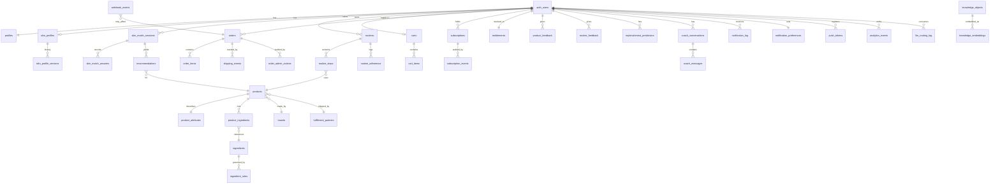

# MGT Skin Care — Master Implementation Blueprint

| | |
|---|---|
| **Version** | 2.0.0 |
| **Date** | 2026-09-05 |
| **Status** | Section 0 (Phase 0 Delta Audit) complete; gate decisions C1/C3/C4/C10 taken 2026-09-05. All sections (0, A–Q) complete; verified 2026-09-05 (locked-decision scan, compliance-language scan, cross-section arithmetic, DDL executed on PG16, financial model re-run). |
| **Locked decisions (2026-09-05)** | C1: Free + Premium at **$14.99/mo** (annual **$149.99** — [assumption], Phase 7's Glow Annual, ~17% discount; confirm). C3: vendor portal + Connect payouts **deferred** to 12-month expansion. C4: AI Coach fine-tuning on chat data **removed**. C10: primary accent **violet #7C3AED**. |
| **Supersedes** | `claude/skincare-pivot-blueprint.md` (v1, Sept 1 2026, the "SkincareAIPlatformBlueprint" PDF) as the working plan. v1 remains the strategic source of truth; where v2 departs from v1 the departure is stated and justified inline. |
| **Inputs** | v1 blueprint; Phase 0 discovery report (Sept 3); skincare-rebuild build logs Phases 1, 3–10; actual Phase 9/10 code; legacy MGT Health build logs Phases 6–67 (esp. Phase 59 consolidation findings, Phases 66–67). GitHub repo not accessible from this session — audited from Drive + project logs only. |
| **Owner** | Gregg Clark — CEO/CTO/CFO |
| **Convention** | Tags: **[sourced]** = traceable to a build log, migration, or the v1 blueprint; **[assumption]** = my inference, to be confirmed; **[decision required]** = yours. Compliance framing is cosmetic-only / no-disease-claims throughout; nothing here is legal or financial advice. |

---

## 0. Phase 0 — Delta Audit (Gate)

### 0.1 What the audit found

The master build prompt assumes a coherent "MGT Skin Care V1" to inspect. What actually exists is three layers that have never been integrated with each other, and the third layer is internally duplicated.

**Layer 1 — Legacy MGT Health & Wellness (Phases 6–67).** Assembled into a single repository for the first time in Phase 59 (Aug 29) at `C:\Users\gmad4\Downloads\mgt-health-app`; 22 migrations consolidated into 106 tables, 163 RLS policies; 38/38 backend tests passing by Phase 66; GitHub push still pending at last record. [sourced: phase-59, phase-66] This is the only layer that has been proven to build and run as a whole. It carries the infrastructure the v1 blueprint said to reuse — Supabase/RLS, Express + security middleware, Stripe billing controller, RevenueCat entitlements, FCM/APNs/Expo notifications, BullMQ scheduler, audit logging, data export, CI/CD, Sentry — plus a K-Beauty marketplace module that already contains a skin quiz, product-match page, and `recommendation.service.js`. [sourced: phases-22-23] The Phase 0 discovery report did not surface that prior skin-quiz work.

**Layer 2 — Skincare rebuild, lineage A (Phase 1, Sept 3).** `skincare-rules-engine.js`, `skincare.routes.js`, `llm/modelRouter.js` with a provider-adapter pattern (local Ollama / DeepSeek / hosted escalation adapters), and a 15-table migration (`skin_profiles`, `skin_match_sessions`, `products_skincare`, `product_scores`, `routines`, `routine_steps`, `routine_feedback`, `product_feedback`, `replenishment_predictions`, `skincare_knowledge_base`, `analytics_events`…). Zero tests; integration checklist never ticked. [sourced: phase-1]

**Layer 3 — Skincare rebuild, lineage B (Phases 3–10, Sept 4–6).** Photo analysis (Ollama vision), a second LLM router (Phase 4, complexity-scored local/hosted routing), a third LLM router (Phase 10, Anthropic-only), a second rules engine + scoring service (Phase 9, tested), a second `skin_profiles` / `skin_match_sessions` schema, columns added directly to `products` instead of `products_skincare`, three separate vector stores, two push-notification stacks, two Stripe subscription services, two data-export services, a Next.js 14 web app that has no relationship to the legacy Vite web app, a vendor portal with Stripe Connect payouts, and OpenAI fine-tuning of the AI Coach. Roughly 185 tests are recorded across these phases, but every phase ends with an unticked "register routes in `server.js`" checklist, and Phase 3's commit could not be pushed. [sourced: phase-3-deployment-summary, phase-7, phase-8] No Phase 2 build log exists in the project.

The honest Phase 0 conclusion: **the rebuild's Phases 1–10 are a set of well-formed but un-integrated artifacts, not a running system.** They were generated faster than they were reconciled, and several of them re-solve the same problem with incompatible schemas. Before any new phase is built, the duplicates have to be collapsed to one implementation each — that consolidation is the real Phase 1 of the v2 plan, and it is cheaper than it looks because in each duplicate pair one side is clearly better.

### 0.2 Duplicate register (must collapse before Phase 1 ends)

| Concern | Implementations found | Keep | Reason |
|---|---|---|---|
| LLM model router | (1) Phase 1 `llm/modelRouter.js` — provider adapters, task map, versioned prompt library; (2) Phase 4 `llm-router.service.js` — complexity-scored local/hosted routing, `llm_routing_log`; (3) Phase 10 `model-router.service.js` — Anthropic-only, safety preamble, prompt caching, `estimateCost` | **Merge into one: adapter interface + task config, safety preamble, local-first routing, caching and cost estimator + `llm_routing_log` telemetry.** Keep Ollama primary and route DeepSeek/OpenClaw through it; use hosted escalation only where justified. | Master prompt §6/§8 requires provider-agnostic routing with telemetry, fallback, retry, circuit breaker. The active gateway now provides those controls and keeps self-hosted inference as the default economic path. |
| Rules engine (Stage 1) | (1) Phase 1 `skincare-rules-engine.js` — 8 inputs incl. age range, current routine, avoidances; routine-slot generator (AM/PM order, top pick + 2 alternates); untested. (2) Phase 9 `skin-rules-engine.service.js` — 10-dim profile vector, 34-ingredient sensitivity-ceiling matrix, 5 avoid flags; 200+ pipeline tests; no age range, no current routine, no desired outcome, no routine-slot logic | **Phase 9 engine as base; port Phase 1's routine-slot generator and the three missing inputs into it.** | Tested code wins as the base. Master prompt §4 lists age range, current routine and desired outcome as required core inputs — Phase 9 dropped them. Routine sequencing is Tier-0 deterministic logic (§7) and Phase 1 already wrote it. |
| Product scoring (Stage 2) | Phase 1 `calculateProductScore()` inside the rules engine; Phase 9 `product-scoring.service.js` (same 40/25/15/10/10 weights, hard filters, brand synergy, reasons) | **Phase 9.** | Separate module, exported scorers, reasons builder already cosmetic-framed. Phase 1's version is redundant. |
| `skin_profiles` / `skin_match_sessions` schema | Phase 1 `20260903000001` (UUID FKs to reference tables, `ingredient_avoidances`, `budget_band`, versioned via `skin_profile_versions`); Phase 9 `20260906000008` (Postgres enums, `profile_vector` jsonb, `avoid_*` booleans, write-once `skin_match_answers`) | **Phase 9 schema + Phase 1's `skin_profile_versions` history table + age band, current routine, desired outcome columns.** Migration `20260903000001` must be rewritten so the two `CREATE TABLE skin_profiles` statements do not collide. | Master prompt §3A wants a *dynamic* profile with history — Phase 1 had versioning, Phase 9 didn't. Phase 9's answer-level audit (`skin_match_answers`, no UPDATE policy) is the better questionnaire record. |
| Product catalog schema | Legacy `products` (K-beauty: `skin_type` enum, weighted tsvector on ingredients); Phase 1 `products_skincare` extension table; Phase 9 eight columns added to `products` (`skin_types_suitable skin_type[]`, `concern_score_map jsonb`…) | **One canonical `products` + `product_attributes` per master prompt §10; migrate Phase 9 columns into it; drop `products_skincare`.** | Three product shapes cannot coexist under one scoring function. The canonical schema needs INCI + normalized ingredients, fragrance/EO/vegan/CF flags, routine slot, AM/PM, frequency, compatibility, cautions, merchant, fulfillment partner, margin, availability, replenishment estimate, subscription eligibility — none of the three has all of it. |
| Vector store / RAG | Phase 1 `skincare_knowledge_base` (HNSW); Phase 4 `product_embeddings` / `ingredient_embeddings` / `research_embeddings` (IVFFlat, Firecrawl web ingestion, `match_embeddings` RPC); Phase 10 `knowledge_embeddings` (HNSW, `fn_match_knowledge` RPC, `skincare_ingredients`, `skincare_concerns`, `routine_templates`, `llm_narrative_cache`) | **Phase 10 store, extended with the master-prompt §9 knowledge-object fields (evidence level, SME approval, source date, content version).** Retire Phase 1 and Phase 4 stores. Keep Phase 4's `ingestProductCatalog()` / `ingestIngredients()` as ingestion jobs writing into the Phase 10 store; **DEFER Firecrawl web ingestion.** | §9 requires every AI factual claim traceable to *approved* knowledge content with SME sign-off. Scraped web pages cannot satisfy that; a Firecrawl pipeline that feeds unreviewed content into RAG is a claims-substantiation liability, not an asset. Embedding API is still unwired in Phase 10 (`[]` vector) — CREATE. |
| Stripe subscriptions | Legacy `billing.controller.js` + `004_billing_schema.sql` (`user_subscriptions`, `payment_events`, Stripe/Apple/Google webhooks, `get_active_subscription` RPC); Phase 4 Next.js `/api/webhooks/stripe` + `subscriptions` table + `stripe_webhook_events`; Phase 7 `subscription.service.js` + `stripe-billing-webhook.routes.js` + `user_subscriptions` + `subscription_events` (UNIQUE `stripe_event_id`) | **Phase 7 service + Phase 7 idempotency table, mounted in the Express API (not Next.js), unified with RevenueCat under one entitlement resolver (Section F).** Retire Phase 4's Next.js webhook and the legacy billing controller. | Master prompt §14 requires server-authoritative, idempotent webhooks. Only Phase 7 has a UNIQUE event-id guard in the rebuild lineage; legacy `payment_events` is an audit log, not an idempotency guard [sourced: legacy inventory]. Webhooks belong in the API tier where the raw-body carve-out already exists (Phase 52 middleware; the Phase 59 path-mismatch bug is a warning about mounting them anywhere else). |
| Push notifications | Legacy `notifications.service.js` (FCM + APNs + email + SMS, quiet hours, 17 types); Phase 5 `notification.service.js` (Expo push); Phase 8 `push-notification.service.js` (Expo push, receipts, BullMQ `notifications` queue) — Phase 5 and Phase 8 both create `push_tokens`, `notification_preferences`, `notification_log` | **Phase 8 service + worker; port legacy quiet-hours logic into it.** Drop Phase 5 duplicate migration. Expo Push only (it fronts FCM/APNs). | Phase 8 is the most complete (receipt polling, dead-token pruning, queue). Quiet hours are a §18 "don't become spam" requirement and legacy already implements them. The legacy 17-type taxonomy is health-oriented; the skincare set is 5 types (Phase 6 hook). |
| Data export / deletion | Legacy Phase 66 `export.service.js` (15-table manifest, boot-time scope assertion, CSV-injection guard, 5-min signed URL) + Phase 65 delete-account; Phase 7 `user-data.service.js` (13-table plan, 24 h signed URL, 30-day deletion grace, pg_cron executors) | **Phase 7 service (has the deletion grace period + pg_cron the master prompt needs) with Phase 66's boot-time `assertUserScoped` and CSV guard ported in.** | v1 said remove self-service export; master prompt §25 says do not remove legally required access rights. Keeping one hardened export path satisfies both — it is the "verified data-access request workflow". |
| Web application | Legacy React + Vite + Tailwind (Router v6, Zustand, 13 storefront pages, 14 admin pages); rebuild Next.js 14 App Router (`web/src/app/…` in Phases 4–9; `web/pages/…` in Phase 10 — a Pages-Router path inside an App-Router app) | **Next.js App Router.** Move Phase 10's page to `web/src/app/skin-match/results/page.tsx`. Legacy Vite pages are reference material for admin/storefront scope, not code to port. | Master prompt §20 names Next.js. The rebuild's storefront, checkout, admin and vendor pages are already Next.js. Two web stacks is one too many. |
| `requireAuth` middleware | Legacy `backend/middleware/auth.js` (`requireAuth`, `requireAdmin`, `requireB2BKey`, `requireScope`); Phase 9 expects `req.userId`; Phase 10 defines its own attaching `req.user` + `req.token` | **One middleware, legacy file, attaching `req.user`, `req.userId`, `req.token`, and a user-scoped Supabase client `req.supabase`.** | Three contracts for the same thing guarantees a runtime failure the first time these routes are mounted together. |
| Analytics events table | Legacy `analytics_events` (partitioned by month, cohort snapshots); Phase 1 `analytics_events` (unpartitioned, re-created) | **Legacy partitioned table; new event taxonomy (Section K) written into it.** PostHog is not wired anywhere despite appearing in v1 — treat as DEFER until volume justifies. | Partitioning already exists; the taxonomy is what's missing, not the table. |

### 0.3 Conflict register (master prompt vs. v1 vs. built code)

| # | Conflict | Positions | Recommendation | Status |
|---|---|---|---|---|
| C1 | **Subscription tiers and prices** — five incompatible schemes | Legacy DB: free / premium_m $9.99 / premium_y $99.90 / provider $29.99. v1 blueprint: Free + Premium $9.99. Phase 0 report: Premium "$39.99 or similar". Phase 4: Essential + Premium (Stripe price env vars only). Phase 7: Glow Monthly $14.99 / Glow Annual $149.99 / Pro Monthly $29.99 / Pro Annual $299.99. RevenueCat entitlements: premium/fitness/skincare/nutrition/family. Mobile: free/basic/premium/enterprise. | Two tiers per v1: **Free** and **Premium**. Phase 7's four SKUs contradict v1's "collapse to 2 tiers" and reintroduce the modular-SKU pattern from the Health app. One RevenueCat entitlement id: `premium`. | **Decided 2026-09-05: Free + Premium $14.99/mo** (annual $149.99 [assumption]). Section N re-models at this price. |
| C2 | **LLM provider strategy** | Earlier provider plans were fragmented across three routers. Master prompt: provider-agnostic, never hard-code one. The active build uses a single local-first gateway with Ollama as the default runtime, DeepSeek as the local reasoning tier, OpenClaw as an optional Ollama-compatible orchestration endpoint, and Sonnet as entitlement-gated hosted escalation. | Provider-agnostic router. Default assignments: high-frequency copy and classification → Ollama fast model; local reasoning fallback → DeepSeek through Ollama; vision → Ollama vision model; premium consultation → Claude Sonnet 5; embeddings → Ollama `nomic-embed-text`. Every assignment is configuration, not caller code. | Decided for the current build |
| C3 | **Vendor portal + Stripe Connect payouts (Phase 8)** | v1: dropship / brand-fulfilled, "do not build a general marketplace / third-party seller platform" in months 1–6. Master prompt §16: one unified storefront; §29 don't over-engineer. Phase 8 built `vendor_profiles`, `commission_rates`, `vendor_payouts`, Connect transfers, a vendor web portal. | **DEFER** to the 12-month expansion. A brand-fulfilled partner is paid on invoice, not via Connect transfers; the portal is marketplace machinery. Keep the migration in the repo behind a feature flag so it isn't lost. | **Decided 2026-09-05: deferred.** |
| C4 | **AI Coach fine-tuning on chat data (Phase 8)** | Master prompt §29: no full MLOps platform; §11: every data use needs a documented purpose, retention, privacy class. Phase 8 exports `chat_messages` to OpenAI fine-tuning jobs. v1 privacy section has no consent basis for training on user conversations. | **REMOVE** from active scope. Prompt engineering + RAG achieves the quality target for Tier 1 tasks at this scale; training on user chat logs needs a consent basis and a counsel review that hasn't happened. Revisit only with a documented purpose and opt-in. | **Decided 2026-09-05: removed.** |
| C5 | **Firecrawl web ingestion into RAG (Phases 4, 6, 7)** | Master prompt §9: knowledge objects need source, source date, evidence level, SME approval, content version; every factual claim traceable to approved content. | **DEFER** — see 0.2 row 6. Replace with an SME-curated ingestion path (CSV/JSON → `knowledge_embeddings` with approval fields). | Recommend |
| C6 | **Telehealth and wearables** re-listed as Phase 8 backlog (Phase 7 log) | v1 and master prompt §24: explicitly out of scope; reintroducing them re-opens the HIPAA/covered-entity analysis. | **DEFER** with the v1 re-entry trigger. Strike from all backlogs. | Recommend |
| C7 | **Concern taxonomy includes `eczema`** (Phase 1 `concerns` seed) | Phase 10's blocked-term list bans the word "eczema"; v1 says no condition-detection. A concern the questionnaire can *select* but the copy engine must *never say* is incoherent. | Use Phase 9's ten cosmetic concerns (acne, anti-aging, brightening, hydration, hyperpigmentation, pore-minimizing, redness relief, texture smoothing, dark circles, firmness). Redness relief covers the cosmetic surface of what a user might call eczema/rosacea; the medical-escalation banner handles the rest. | Recommend |
| C8 | **`sensitive` as a skin *type*** (Phase 9 enum) alongside a separate sensitivity *level* | v1: four skin types (dry/oily/combination/normal) + sensitivity as its own gate. | Remove `sensitive` from `skin_type`; keep `skin_sensitivity` (none/mild/moderate/high). Adjust `BASE_VECTOR_BY_SKIN_TYPE` accordingly. | Recommend |
| C9 | **Skin Match duration** | v1: 3–5 minutes end to end, 8 required inputs under 90 s. Master prompt §4: 60–90 s core. Phase 9: 7 required steps + review. | Consistent once age band, current routine and desired outcome are added as single-tap steps — target 10 core taps in ≤ 90 s, optional steps after the first result. Measure it (Section K event `skin_match.completed` carries `duration_ms`). | No conflict — aligned |
| C10 | **Brand, scheme, accent colour** | Deep-link schemes `mgthealth://` (Phase 62) vs `mgtaura://` (Phase 52); domain `app.mgtskincare.com` (Phase 4); accents pink `#E75480` (Phase 6), `#FF69B4` (Phase 8), rose sidebar (Phase 5), violet `#7C3AED` (Phases 9–10), legacy mesh-indigo `#6366f1`. Aura affiliation is to be removed per your Aug 29 instruction. | One scheme (`mgtskincare://`), one domain, one design-system token file (Section G). | **Decided 2026-09-05: violet #7C3AED.** |
| C11 | **Phase numbering** | Legacy Health Phases 1–67 and skincare-rebuild Phases 0–10 share numbers; Drive folders "Phase 7 — Production Infrastructure", "Phase 8 — …" are rebuild phases with legacy-sounding names. Master prompt defines new Phases 0–6. | Prefix all rebuild artifacts **SC-** (SC-P0 … SC-P6 for the v2 plan; the Sept 3–6 work becomes "SC-pre" lineage). Project doc paths for v2 use `claude/sc-phase-N-…`. | Recommend |
| C12 | **Self-service data export** | v1: remove, replace with manual verified process. Master prompt §25: don't remove legally required rights. Built: two implementations. | Keep one (0.2 row 8). v1's concern was product framing, not the capability; a verified in-app export *is* the access-request workflow. | Recommend |
| C13 | **Premium consultation gate** | Phase 10 router documents `requirePremium` but does not enforce it. | Enforce in the router via the entitlement resolver (Section F). Tier-3 calls without entitlement must fail closed. | CREATE, SC-P3 |

### 0.4 Build Audit table (this is master-prompt Section B)

Actions: **REUSE** as-is · **REFACTOR** keep and modify · **REPLACE** rebuild with a different implementation · **REMOVE** from active product · **CREATE** new · **DEFER** to 12-month expansion. Phase column refers to the v2 plan (SC-P1…SC-P6, Section H).

**Platform & infrastructure**

| Component | Existing State | Action | Reason | Phase |
|---|---|---|---|---|
| Supabase Postgres + Auth + Storage + RLS conventions (`is_admin()`, `user_has_feature()`, `createUserClient(jwt)`) | Legacy, consolidated Phase 59, 163 policies, live PG16 [sourced] | REUSE | Backend of record; RLS pattern proven across 106 tables | — |
| Express API + security middleware (Helmet, CORS allowlist, 6 rate-limit tiers, request-id, central error handler) | Legacy Phase 52 [sourced] | REUSE | Nothing in the rebuild replaces it; rebuild routes assume it | — |
| `requireAuth` / `requireAdmin` middleware | Three incompatible contracts (0.2) | REFACTOR | Single contract attaching `req.user`, `req.userId`, `req.token`, `req.supabase` | SC-P1 |
| BullMQ + Redis worker + scheduler (`backend/jobs/scheduler.js`) | Legacy Phase 52; rebuild Phases 6–8 add queues `firecrawl-ingest`, `notifications`, ab-auto-stop [sourced] | REUSE | v1 Option B requires it; already present | — |
| pg_cron jobs (export expiry, deletion executor, renewal reminders, routine nudges) | Phase 8 migration [sourced] | REUSE | Cheaper than worker jobs for pure-SQL schedules | — |
| GitHub Actions CI (`ci.yml`: lint/test/migrate-on-clean-PG/secret-scan) + EAS build/OTA (`eas-build.yml`) | Legacy Phase 66 + rebuild Phase 7 [sourced] | REUSE | Directly transferable; add E2E job later | — |
| Sentry (backend `beforeSend` drops request data; mobile no screenshots) | Legacy Phase 65 [sourced] | REUSE | Keep PHI-style scrubbing as photo-adjacent hygiene | — |
| Docker / hosting target | Unsettled: PM2 cluster vs Docker+SSH vs Vercel across Phases 42/52 [sourced] | REFACTOR | Pick managed containers (Render/Fly/Railway) per v1 Option B; Vercel for Next.js | SC-P1 |
| Audit logging (`audit_logs` append-only triggers, `auditLog.js` middleware, `data-retention.js`) | Legacy Phases 11–15 [sourced] | REUSE | Master prompt §25 audit requirement met | — |
| MongoDB/Mongoose remnants | Removed in Phase 59 [sourced] | REMOVE (verify) | Confirm no imports remain | SC-P1 |

**Identity, profile, privacy**

| Component | Existing State | Action | Reason | Phase |
|---|---|---|---|---|
| Supabase Auth, `profiles`, change-password, avatar, soft-delete + storage purge trigger | Legacy Phase 65 [sourced] | REUSE | Canonical identity = `auth.users.id` across web/iOS/Android/commerce/analytics (§12) | — |
| Account deletion with 30-day grace + pg_cron executor | Rebuild Phase 7 [sourced] | REUSE | Legacy hard-delete lacked a grace window | — |
| Data export | Two implementations (0.2) | REFACTOR | Phase 7 service + Phase 66 safeguards | SC-P1 |
| Consent management, AI disclosure, photo-consent modal, medical-escalation banner | Not found in any log | CREATE | v1 legal surfaces; §25 | SC-P2 |
| `user_onboarding` (`personalization_tags`) | Legacy Phase 67 [sourced] | REMOVE | Superseded by skin profile; health-oriented quiz | SC-P1 |
| PHI leak detector / body limits | Legacy [sourced] | REUSE | Cheap, still useful for photo/profile routes | — |

**Skin Match & personalization (Stages 1–5)**

| Component | Existing State | Action | Reason | Phase |
|---|---|---|---|---|
| Rules engine (Stage 1) | Two (0.2) | REFACTOR | Phase 9 base + age band, current routine, desired outcome, routine-slot generator; remove `sensitive` skin type | SC-P2 |
| Ingredient sensitivity-ceiling matrix (34 entries) + avoid-flag mapping | Phase 9 [sourced] | REFACTOR | Move from code constants to a versioned `ingredient_rules` table with SME sign-off column; keep code as loader. 100% safety-matrix test coverage stays (§32) | SC-P2 |
| Product scoring (Stage 2) | Phase 9 [sourced] | REUSE | Weights per v1; add compatibility/conflict check and routine-slot fill | SC-P2 |
| Questionnaire schema + `GET /questions` | Phase 9 (12 entries) [sourced] | REFACTOR | Add three core inputs; mark optional steps; progressive disclosure | SC-P2 |
| Mobile `SkinMatchScreen.tsx` (8 steps) / web `skin-match/page.tsx` | Phase 9 [sourced] | REFACTOR | Add steps; pre-account result (§4) | SC-P2 |
| Results screens (mobile + web) | Phase 10 [sourced] | REFACTOR | Fix web path; wire to routine engine instead of `routine_slot` field that doesn't exist in the schema | SC-P2 |
| Photo analysis (Stage 3) — Ollama vision, ≤30 s delete, immutable audit, 23 tests | Phase 3 [sourced] | REUSE | Meets §5; add automated "no persisted image" test to CI | SC-P2 |
| LLM personalization (Stage 4) — narrative, blurbs, safety scan, cache | Phase 10 [sourced] | REFACTOR | Re-point at unified router; wire embeddings; add structured-output schema validation | SC-P2 |
| Premium consultation (Stage 5) | Router config only; gate unenforced | CREATE | Entitlement-gated Tier-3 path with conversation memory | SC-P3 |
| AI Coach chat sessions/messages (`ai_conversations`, `ai_messages`, prompt templates, SSE streaming) | Legacy Phase 26/59 [sourced] | REFACTOR | Re-prompt as Skincare Coach; route through unified router; drop health-anomaly RPCs | SC-P3 |
| AI Coach fine-tuning pipeline | Phase 8 [sourced] | REMOVE | C4 | — |
| Legacy K-beauty skin quiz, `skinAnalysis.service.js`, `recommendation.service.js` | Legacy Phases 22–23 [sourced] | REMOVE | Superseded by Stages 1–2; keep as reference for UX copy | SC-P1 |

**AI platform**

| Component | Existing State | Action | Reason | Phase |
|---|---|---|---|---|
| Model router | Three (0.2) | REFACTOR | One provider-agnostic router; CREATE retry, timeout, fallback chain, circuit breaker, per-user budgets, prompt versioning, A/B hook | SC-P1 skeleton, SC-P2 complete |
| `llm_routing_log` + routing stats view | Phase 4/5 [sourced] | REFACTOR | Extend with provider, prompt_version, fallback flag, structured-output failure, cost | SC-P1 |
| Prompt library | Phase 1 (versioned, v1) + Phase 10 `SYSTEM_PROMPTS` + Phase 4 inline prompts | REFACTOR | One versioned prompt registry (Section L) | SC-P2 |
| Knowledge base + RAG | Three stores (0.2) | REFACTOR | Phase 10 store + §9 knowledge-object fields; SME approval workflow in admin | SC-P2 |
| Embedding client | None wired | CREATE | Provider-agnostic `embed()` in the router | SC-P2 |
| Firecrawl ingestion (sync, async worker, nightly re-ingest) | Phases 4/6/7 [sourced] | DEFER | C5 | — |
| AI evaluation harness (unsupported-claim rate, structured-output compliance, prompt regression) | Not found | CREATE | v1 KPI "0 unsupported claims across 50-case set"; §32 | SC-P2 |
| AI cost dashboard + alerts | `llm_routing_stats` view only | CREATE | §27 | SC-P4 |
| Ollama tiers | Phase 4 [sourced] | REUSE | C2 | SC-P1 |

**Catalog, routine, replenishment**

| Component | Existing State | Action | Reason | Phase |
|---|---|---|---|---|
| Product schema | Three (0.2) | REPLACE | Canonical `products` + `product_attributes` + `product_ingredients` (§10) | SC-P1 |
| Product ingestion pipeline (API/CSV/XML/JSON/sheet/manual) | Phase 4 `ingestProductCatalog()` only | CREATE | §10 | SC-P1 (CSV/JSON), SC-P3 (partner API) |
| Routine engine (AM/PM/weekly, sequencing, conflicts, substitutions, simplify/cheaper/travel modes) | Phase 1 `generateRoutineStructure()` (basic); Phase 1 `routines`/`routine_steps` tables; Phase 10 `routine_templates` | REFACTOR + CREATE | Deterministic Tier-0 engine per §3D; tables from Phase 1, templates from Phase 10 | SC-P3 |
| Replenishment engine | Phase 1 `replenishment_predictions` table only | CREATE | §18; feeds notifications + cart | SC-P4 |
| Product / routine feedback tables | Phase 1 [sourced] | REUSE | Feedback loop §3B | SC-P4 |
| Routine adherence tracking | Not found | CREATE | §3B "USE" step | SC-P4 |

**Commerce**

| Component | Existing State | Action | Reason | Phase |
|---|---|---|---|---|
| `orders`, `order_items`, shipping columns, `shipping_events`, `order_admin_actions` | Phase 4 + Phase 6 [sourced] (legacy marketplace orders separate) | REFACTOR | One `orders` lineage (rebuild); migrate nothing from legacy (no real customers) [assumption — confirm no live orders exist] | SC-P1 |
| Stripe Checkout / Payment Element for physical goods, guest checkout pre-creating pending order | Phase 4 Next.js route [sourced] | REFACTOR | Move session creation to Express; keep guest flow | SC-P3 |
| Stripe webhooks (physical + subscription) | Three (0.2) | REFACTOR | Phase 7 handler, extended to `checkout.session.completed`, `payment_intent.*`, `charge.refunded`, `charge.dispute.created` | SC-P1 |
| Refunds (`admin-order-actions`) | Phase 6 [sourced] | REUSE | Already server-side via `refunds.create()` | — |
| Carrier webhooks (FedEx/UPS HMAC) | Phase 6 [sourced] | REUSE | Needed for brand-fulfilled tracking | — |
| RevenueCat (`rc_entitlements`, `rc_webhook_events`, `/api/iap/*`, mobile paywall) | Legacy Phase 49/63 [sourced] | REFACTOR | Single entitlement id `premium`; unify with Stripe under one resolver | SC-P1 |
| Entitlement resolver (web Stripe ∪ Apple ∪ Google → one `premium` boolean + source) | `get_active_subscription` RPC (legacy) partially | CREATE | §15 | SC-P1 |
| Intelligent cart ("My Routine Cart": swap, cheaper/premium alternative, compatibility, bundle savings) | Cart drawer + sessionStorage cart (Phases 4/10) | REPLACE | Server-side cart with explanations (§17) | SC-P3 |
| Smart bundles | `bundles` category only | CREATE | §22 | SC-P3 |
| Vendor portal + Stripe Connect payouts + commission rates | Phase 8 [sourced] | DEFER | C3 | — |
| Legacy marketplace (brands, wishlists, reviews, promo codes, affiliate clicks, B2B API keys) | Legacy Phases 22–23, 47 [sourced] | REMOVE (archive) | v1 "no general marketplace", "no B2B in months 1–6" | SC-P1 |
| Referral codes + credits + user dashboard | Phase 5/6 [sourced] (legacy `referral_rewards` separate) | REUSE | Launch growth loop (SC-P5) | — |
| Fulfillment partner order-forwarding (API/CSV) | Not found | CREATE | v1 Option B; §30 Phase 5 "2 partners" | SC-P3 (manual CSV), SC-P5 (API) |

**Notifications, analytics, admin**

| Component | Existing State | Action | Reason | Phase |
|---|---|---|---|---|
| Push notification service + worker + preferences | Three (0.2) | REFACTOR | Phase 8 + legacy quiet hours | SC-P1 |
| Mobile push hook (5 skincare types) | Phase 6/8 [sourced] | REUSE | — | — |
| Analytics events table | Two (0.2) | REFACTOR | Legacy partitioned table + Section K taxonomy | SC-P1 |
| Funnel / cohort / AI-cost dashboards | Phase 5/7 admin analytics (revenue, funnel, referral, A/B, LLM routing) [sourced] | REFACTOR | Extend to the full §26 funnel and §27 AI economics | SC-P4 |
| A/B testing (Beta-Binomial auto-stop) | Phase 5/6 [sourced]; legacy `experiments` tables separate | REUSE (rebuild) | Needed for §8 model A/B and SC-P6 experiments | — |
| Admin console (orders, users, analytics, RAG, order actions) | Phase 5–7 Next.js [sourced]; legacy 14 Vite admin pages | REFACTOR | Add products/ingredients/knowledge approval/prompts/model performance/support (§33); RBAC + audit on every action | SC-P3 |
| Legacy admin pages (Vite) | Legacy [sourced] | REMOVE | Reference only | SC-P1 |

**Out of scope (v1 + master prompt §24)**

| Component | Existing State | Action | Reason | Phase |
|---|---|---|---|---|
| Vitals, body measurements, sleep, activity, wearables OAuth + sync, telehealth, medications/supplements, health scores, wellness plans, B2B outcome billing, partner portal | Legacy, assembled Phase 59 [sourced] | REMOVE (archive migrations under Drive folder 20) | Regulatory exposure with no skincare revenue path | SC-P1 |
| Telehealth scheduling / wearables ingestion in rebuild backlog | Phase 7 backlog text only | DEFER (strike) | C6 | — |

### 0.5 What is genuinely new in the master prompt (not in v1, not built)

These are the CREATE items that justify calling this v2 rather than "finish v1": dynamic skin profile with feedback-driven re-personalization (§3A–B); routine intelligence commands ("make it simpler / cheaper / I'm travelling") (§3D); explainability contract per product (§3C); intelligent cart and smart bundles (§17, §22); replenishment engine (§18); unified entitlement resolver (§15); event taxonomy with purpose/retention/privacy class per event (§11); router telemetry, fallback, circuit breaker, budgets, A/B (§8); knowledge objects with evidence level and SME approval (§9); product ingestion pipeline (§10); admin RBAC across all of the above (§33); AI eval harness and cost dashboard (§27, §32). Everything else in the prompt is either already built (needs consolidation) or already specified in v1.

### 0.6 Gate — decisions required before SC-P1 begins

The audit is complete. C1, C3, C4 and C10 were decided 2026-09-05 (see header). Everything else in 0.2–0.4 is a recommendation being proceeded on. One structural assumption to confirm: **[assumption]** there are no live customers, orders, or subscriptions in the legacy database, so no data migration is needed — only schema consolidation. If that's wrong, SC-P1 gains a migration workstream.

---

## A. Executive Strategy

### A.1 Product vision

MGT Skin Care is a personal skincare operating system: a consumer tells it about their skin once, receives a routine and the products to fill it, buys them in one tap, and from then on the system quietly keeps the routine right — adjusting to feedback, replacing what isn't working, and reordering what is before it runs out. The intelligence is deliberately invisible. What the user experiences is the loop the master prompt names: *tell us about your skin → get my routine → understand why → shop it → use it → give feedback → improve it → reorder it.* Every architectural choice in this document exists to make one pass of that loop faster, safer, or more profitable than the last.

The positioning line carries forward from v1 unchanged: *"Personalized skincare guidance, powered by AI — matched to your skin, delivered to your door."* Secondary, for compliance-sensitive surfaces: *"A smarter way to shop for skincare, not a substitute for medical care."* [sourced: v1 GTM]

### A.2 Business model

Two revenue lines, both live from launch week. **Product margin** on brand-fulfilled (dropship) skincare sold through one owned storefront — no owned inventory in months 1–6, no marketplace, no private label. **Premium subscription** at $14.99/month ($149.99/year [assumption]) covering full re-personalization, replenishment automation, priority Skincare Coach access, the Tier-3 consultation, and member pricing. Free tier keeps the whole Skin Match and a browsable routine so the funnel top stays wide; the paywall sits at the point where ongoing intelligence begins, not at the first result. [sourced: v1 revenue strategy; C1 decision]

The commercial engine is *Shop My Routine* (master prompt §16): the routine is the cart. A completed Skin Match yields a pre-built, compatibility-checked, budget-aware cart; the purchase populates the routine tracker; the routine tracker drives replenishment; replenishment drives repeat revenue. Everything else — bundles, swaps, "cheaper alternative," coach answers — is a way to keep a user inside that loop.

### A.3 Differentiation (why this wins)

The competitive set (Section M) splits into B2B recommendation engines that never own the customer, beauty retailers whose quizzes are lead-gen for a static catalog, medical-grade analysis tools that carry regulatory weight this product deliberately avoids, and AI chat assistants with no commerce loop. None of them combine a *dynamic* skin profile, a deterministic and explainable matching engine, an owned commerce relationship, and a feedback loop that makes month six better than month one for the same customer. The defensible asset is not the model — models are rented — it is the accumulating per-customer record of what was recommended, what was bought, what was kept, and what was said about it, wrapped in a product that a consumer understands in ninety seconds.

Five differentiators the build must actually deliver, each with the section that specifies it: dynamic skin profile with versioned history and feedback-driven re-personalization (D, E); explainable recommendations with a fixed explanation contract per product (E.6, I); deterministic routine intelligence that answers "make it simpler / cheaper / I'm travelling" without an LLM (C.4, I); the routine-as-cart with swap, alternative, and bundle logic that explains its own changes (F, I); replenishment timing computed from the routine, not a generic 30-day subscribe-and-save (C.4, K).

### A.4 Six-month objectives

By week 24 (SC-P6 close): public launch on web, iOS, and Android with Stripe commerce and one Premium entitlement recognised across all three billing sources; at least two brand-fulfilled partners live; Skin Match core completing in ≤ 90 seconds at ≥ 65% completion; measured Skin-Match-to-first-purchase conversion ≥ 8%; Premium attach ≥ 8% of purchasers; 0 unsupported-claim outputs on the evaluation harness; AI cost per user ≤ $0.02; counsel sign-off on all six v1 legal-checklist items before public launch; and a Phase-2 (12-month) proposal built on real funnel and retention data rather than the assumptions in Section N. [sourced: v1 KPI dashboard, adjusted for master prompt §26 and the $14.99 price]

### A.5 What v2 changes relative to v1

v1 was correct on strategy, stack, regulatory posture, and team; v2 keeps all of it. v2 changes four things. It treats the Sept 3–6 build as a consolidation liability rather than finished work (Section 0). It replaces "a small LLM writes the copy" with a provider-agnostic routed AI layer with telemetry and budgets, because the master prompt's non-negotiables require it and because the three routers already written prove the point. It adds the closed feedback loop, routine intelligence, intelligent cart, replenishment engine, and event taxonomy as first-class specified systems rather than roadmap bullets. And it raises the Premium price from $9.99 to $14.99, which changes the unit economics in Section N materially in the business's favour if conversion holds — a hypothesis SC-P4 beta exists to test.

---

## C. Product Architecture

### C.1 System architecture

v1's Option B (Balanced Production) stands. What v2 adds is precision about which process owns which responsibility, because the Sept 3–6 build put webhooks in Next.js, business logic in both Express and Next.js API routes, and three copies of the AI layer in the same tier.

```
┌──────────────┐  ┌──────────────┐  ┌──────────────┐
│  Web (Next)  │  │  iOS (Expo)  │  │Android (Expo)│      Clients — UI only.
└──────┬───────┘  └──────┬───────┘  └──────┬───────┘      Shared: @mgt/domain (TS), API client,
       │  HTTPS / Supabase JWT             │              design tokens, analytics SDK.
       └──────────────┬───────────────────┘
                      ▼
┌──────────────────────────────────────────────────────┐
│  API — Express (one process, horizontally scaled)     │   All business logic. All webhooks.
│  auth · profile · skin-match · routine · catalog ·    │   Raw-body carve-outs for /webhooks/*.
│  cart · checkout · orders · subscriptions ·           │   RLS via user-scoped Supabase client;
│  entitlements · notifications · coach · admin         │   service-role client only in workers,
└───────┬───────────────────────┬──────────────────────┘   webhooks, and admin paths.
        │ enqueue               │ sync call
        ▼                       ▼
┌────────────────┐    ┌──────────────────────────────┐
│ Workers (BullMQ│    │  AI Gateway (in-process lib)  │   Not a service — a module the API and
│ + Redis)       │◄───┤  task classifier → router →   │   workers import. Provider adapters,
│ ai-jobs ·      │    │  provider adapter → validator │   retry/fallback/circuit-breaker, budgets,
│ vision-jobs ·  │    │  → structured response        │   telemetry to llm_routing_log.
│ ingestion ·    │    └──────────────┬───────────────┘
│ fulfillment ·  │                   │
│ replenishment ·│                   ▼
│ analytics ·    │    ┌──────────────────────────────┐
│ notifications  │    │ Ollama · OpenClaw · Anthropic │   Local first; hosted escalation by config.
└───────┬────────┘    │ (+ any OpenAI-compatible)    │
        │             └──────────────────────────────┘
        ▼
┌──────────────────────────────────────────────────────┐
│  Supabase — Postgres (+pgvector, pg_cron) · Auth ·    │   System of record. RLS on every
│  Storage (short-TTL selfie bucket, exports bucket)    │   user-scoped table.
└──────────────────────────────────────────────────────┘
        ▲                       ▲
        │ webhooks (raw body)   │ webhooks
┌───────┴────────┐    ┌─────────┴──────────┐   ┌──────────────────┐
│ Stripe         │    │ RevenueCat         │   │ Fulfillment      │
│ (physical +    │    │ (Apple/Google subs)│   │ partners (API /  │
│  web subs)     │    │                    │   │ CSV / email)     │
└────────────────┘    └────────────────────┘   └──────────────────┘
```

Three rules make this hold together. **Next.js never talks to Stripe, RevenueCat, or the AI providers directly** — it calls the Express API like the mobile apps do; the Phase 4 `/api/webhooks/stripe` and `/api/checkout/*` Next.js routes are removed in SC-P1. **The AI Gateway is a library, not a microservice** — it is imported by the API for synchronous Tier-1 calls (blurbs, coach answers) and by the `ai-jobs` worker for anything that can wait (narratives on Skin Match completion, batch re-personalization). **Every webhook is idempotent by event id and processed asynchronously** — the handler verifies the signature, inserts the event id into a UNIQUE-constrained table, returns 200, and enqueues the work.

### C.2 Service (module) architecture

The API is one Express process organised as domain modules, each with `routes → controller → service → repository` layering and a single `index.js` that mounts its router. Modules and the existing code each one absorbs:

| Module | Mount | Absorbs (from Section 0) | New in v2 |
|---|---|---|---|
| `auth` | `/api/auth` | Legacy auth, profile, change-password, avatar, delete-account (P65); unified `requireAuth` | — |
| `me` | `/api/me` | Phase 7 export/deletion; Phase 8 push-token + notification prefs | consent records, AI-disclosure acknowledgement |
| `skin-match` | `/api/skin-match` | Phase 9 routes + engine + scoring; Phase 10 results; Phase 3 photo routes | age/routine/outcome inputs, pre-account session token, `skin_profile_versions` |
| `profile` | `/api/skin-profile` | Phase 9 `GET /profile` | dynamic profile read/patch, timeline, re-personalization trigger |
| `routine` | `/api/routine` | Phase 1 `routines`/`routine_steps`, Phase 10 `routine_templates` | routine engine: build, sequence, swap, simplify, cheaper, travel, adherence log |
| `catalog` | `/api/catalog` | Phase 9 products columns, Phase 4 product embeddings, legacy tsvector search | canonical product schema, alternatives, ingestion admin |
| `cart` | `/api/cart` | — (client-side sessionStorage cart replaced) | server-side routine cart, swap/alternative/bundle, compatibility + availability validation |
| `checkout` | `/api/checkout` | Phase 4 session creation (moved from Next.js) | Payment Element + Checkout, guest checkout, tax/shipping |
| `orders` | `/api/orders` | Phase 4/6 orders, shipping events, admin actions, refunds | fulfillment forwarding, partner status |
| `subscriptions` | `/api/subscriptions` | Phase 7 service + billing webhook; legacy RevenueCat `/api/iap` | one entitlement resolver |
| `replenishment` | `/api/replenishment` | Phase 1 table | prediction job, reorder/delay/skip/cancel |
| `coach` | `/api/coach` | Legacy conversations/messages/streaming (P26/P59); Phase 10 `answerSkinQuestion` | routine-command intents, premium gate, shopping-assistant tools |
| `knowledge` | `/api/knowledge` | Phase 10 store + RPC | approval workflow, curated ingestion, embed job |
| `analytics` | `/api/analytics` | Legacy events table; Phase 5/7 admin analytics | Section K taxonomy, funnel + AI-cost dashboards |
| `admin` | `/admin` | Phase 5–7 admin routes | RBAC (`admin_users` roles), audit on every mutation, products/ingredients/knowledge/prompts/models |
| `webhooks` | `/webhooks` | Phase 7 Stripe billing, Phase 6 carriers, legacy RevenueCat | unified idempotency table `webhook_events` |

A shared TypeScript package `@mgt/domain` (built in SC-P1) holds the enums, the Skin Profile type, the explanation contract, the questionnaire schema, validation, and money/date helpers, and is consumed by the API, the Next.js app, and the Expo app — this is how "no separate business logic per platform" (master prompt §20) is enforced rather than hoped for.

### C.3 Database architecture

One Supabase project, one `public` schema for operational tables, plus `analytics` and `knowledge` schemas so retention policies, RLS, and future warehouse extraction are schema-scoped. Every user-scoped table carries `user_id uuid references auth.users` and an RLS pair (owner select/insert/update; service-role all). Immutable tables (`skin_match_answers`, `webhook_events`, `*_audit`, `notification_log`, `order_admin_actions`, `subscription_events`) use the Phase 6/7 `BEFORE UPDATE OR DELETE` trigger pattern. pgvector lives in `knowledge`. Full entity list and DDL in Sections D and J.

### C.4 Tier-0 engines (deterministic, no AI)

Master prompt §7 puts classification, safety, eligibility, compatibility, sequencing, pricing, replenishment, and entitlement in plain code. v2 names them so they can't be quietly re-implemented as prompts:

`RulesEngine` (Stage 1) — profile classification, ingredient safety matrix, avoid flags. `ScoringEngine` (Stage 2) — hard filters, weighted score, reasons. `RoutineEngine` — slot assignment (AM/PM/weekly/treatment-cycle), ordering (cleanser → toner → serum → treatment → moisturizer → SPF), product-pair conflict rules (e.g. retinoid × AHA/BHA same session, vitamin C × niacinamide caution note, benzoyl peroxide × retinol), frequency, substitution search, and the three transforms — `simplify(routine)` (drop optional slots to a 3–4 step core), `cheapen(routine, targetDelta)` (per-slot alternative search minimising score loss per dollar saved), `travel(routine, days)` (multi-use products, size ≤ 100 ml, skip weekly). `CartEngine` — build from routine, swap with explanation, alternative search (cheaper / premium / cleaner / gentler), compatibility + availability validation, bundle pricing. `ReplenishmentEngine` — run-out estimate from size, frequency, usage report, purchase history. `EntitlementResolver` — Stripe ∪ Apple ∪ Google → one boolean. `PricingEngine` — tax/shipping/discount/member-pricing arithmetic. Each is a pure function over typed inputs, unit-tested, versioned by a `rules_version` string written into every session and recommendation row.

### C.5 API architecture

REST over HTTPS, JSON, versioned by path prefix (`/api/v1/…` — the legacy prefix convention [sourced: phase-0 report]). Auth is the Supabase JWT in `Authorization: Bearer`; pre-account Skin Match uses a signed `session_token` (Phase 1 pattern) exchanged for a user on signup. Errors follow one envelope `{ error: { code, message, details? , request_id } }`. Rate limits per tier (legacy six-tier `express-rate-limit`), plus per-user AI budgets enforced in the gateway. Webhooks under `/webhooks/*` with raw-body parsing and signature verification. Full spec in Section I.

### C.6 AI architecture

```
request ──► Task Classifier ──► Router ──► Provider Adapter ──► Validator ──► response
              (task_type,        (config:    (Anthropic |         (JSON schema,
               tier, budget)      model,      OpenAI |            blocked-term scan,
                                  fallback    Ollama |            grounding check)
                                  chain)      generic OpenAI-
                                              compatible)
                         │                          │
                         └──── llm_routing_log ◄────┘   (model, provider, task, prompt_version,
                                                         latency, tokens, cost, fallback, validation_fail)
```

Task classification is *not* an LLM call and *not* the Phase 4 complexity heuristic; it is the caller naming a `task_type` from a fixed registry (Section E.3). The router reads a config row per task (`primary`, `fallbacks[]`, `max_tokens`, `temperature`, `budget_class`, `requires_entitlement`, `prompt_version`), applies circuit-breaker state per provider, and executes with timeout + one retry before falling back. The validator enforces a JSON schema per task, runs the Phase 10 blocked-term scan, and — for grounded tasks — checks that every cited knowledge id exists in the retrieved set. RAG is pgvector in the `knowledge` schema over SME-approved objects only. Vision is a separate `vision_analysis` task with its own adapter contract (image in, coarse attributes out, image never persisted). Evaluation and cost control in E.7–E.8.

### C.7 Commerce architecture

```
Skin Match ──► Routine ──► Cart (server) ──► Stripe Checkout / Payment Element
                 ▲              │                       │
                 │              │ swap/alt/bundle       │ checkout.session.completed
                 │              ▼                       ▼
            Feedback ◄──── Order (pending → paid → forwarded → shipped → delivered)
                 ▲                                      │
                 │                          fulfillment worker → partner API / CSV
                 │                                      │ carrier webhook
                 └──────── Replenishment ◄──────────────┘
```

Stripe is server-authoritative: the order exists as `pending` before the session is created, becomes `paid` only on the verified webhook, and the client success page merely polls order status. Subscriptions: web via Stripe Billing, mobile via Apple/Google through RevenueCat, both writing to `subscriptions` and resolved to one entitlement (Section F). Fulfillment: `orders.fulfillment_partner_id` routes to a partner adapter (API where available, CSV email otherwise) via the `fulfillment` worker with retry; partner status callbacks and carrier webhooks update `shipping_events`. No inventory ledger; availability comes from the partner feed.

### C.8 Analytics architecture

Phase 1 (this six months): a single `analytics.events` partitioned table (legacy) receiving the Section K taxonomy from all three clients and the API, plus nightly SQL rollups into `analytics.daily_funnel`, `analytics.daily_ai_cost`, `analytics.cohorts` (legacy cohort snapshot job). Dashboards read rollups, never raw events. Every event has a purpose, retention class, and privacy class in the taxonomy; the retention job (legacy `data-retention.js`) enforces the class. PostHog is deferred until the in-house table is the bottleneck. Warehouse (BigQuery) is a 12-month decision gated on event volume > ~50M rows/month [assumption].

---

## D. Data Architecture

### D.1 Entity-relationship model



### D.2 Entities

The customer graph in master prompt §12 maps onto the tables below. "Origin" says which existing artifact the table comes from; everything else is CREATE.

| Domain | Table | Purpose | Origin |
|---|---|---|---|
| Identity | `auth.users`, `profiles` | Canonical identity id = `auth.users.id`; display fields, `deleted_at` soft delete | Legacy P65 |
| Identity | `consents` | One row per consent type (terms, privacy, ai_disclosure, photo, marketing) with version + timestamp | CREATE |
| Skin | `skin_profiles` | Current dynamic profile: skin type, primary/secondary concern, sensitivity, age band, current routine level, desired outcome, budget, avoid flags, `avoid_ingredients[]`, `preferred_brands[]`, `profile_vector`, `visual_attributes` (coarse, from photo), `rules_version` | P9 + P1 + new |
| Skin | `skin_profile_versions` | Immutable snapshot per change with `reason` (questionnaire, photo, feedback, user_edit, re-personalization) | P1 |
| Skin | `skin_match_sessions`, `skin_match_answers` | Questionnaire sessions (pre-account via `session_token`), write-once answers | P9 + P1 |
| Skin | `recommendations` | One row per product per session: score, dimension scores, reasons, explanation JSON (the E.6 contract), `rules_version` — replaces `scoring_output` jsonb blob | CREATE (P10 assumed it) |
| Skin | `photo_analysis_audit` | Upload/analysis/deletion log; never the image | P3 |
| Routine | `routines`, `routine_steps` | AM/PM/weekly/treatment routines; steps with order, product, frequency, instructions, why, alternatives, conflict notes; `mode` (standard/simple/travel), `version` | P1 + new |
| Routine | `routine_templates` | Blueprint per (skin type, concern, complexity, sensitivity) | P10 |
| Routine | `routine_adherence` | Daily check-ins per step (done/skipped), source (app/notification) | CREATE |
| Catalog | `products` | Canonical product: SKU, brand, category, routine slot, AM/PM, frequency, price, sale price, size, images, description, merchant, `fulfillment_partner_id`, margin, availability, shipping class, replenishment days, subscription eligible, status | REPLACE (P9 columns + legacy + P1 merged) |
| Catalog | `product_attributes` | Suitability arrays, concern/skin-type score maps, sensitivity tier, fragrance/EO/vegan/CF flags, compatibility[], caution flags[], `max_sensitivity` | P9 columns moved |
| Catalog | `product_ingredients`, `ingredients` | INCI list normalised to `ingredients` rows (`inci_name`, `slug`, `function`, `aliases[]`) | CREATE (P1 seed reused) |
| Catalog | `ingredient_rules` | Sensitivity ceiling, conflicts, cautions, SME sign-off, `rules_version` — the Phase 9 matrix moved out of code | CREATE |
| Catalog | `brands`, `fulfillment_partners`, `partner_feeds` | Partners, integration type (api/csv/email), feed schedule, last ingest | CREATE (legacy `brands` reused) |
| Commerce | `carts`, `cart_items` | Server-side routine cart; item `origin` (routine/swap/alternative/bundle), `explanation` | CREATE |
| Commerce | `bundles`, `bundle_items` | Curated + generated bundles with savings | CREATE |
| Commerce | `orders`, `order_items`, `shipping_events`, `order_admin_actions` | Order lifecycle, carrier tracking, admin audit | P4/P6 |
| Commerce | `fulfillment_jobs` | Per-order forwarding attempts to partner, status, payload hash | CREATE |
| Billing | `subscriptions`, `subscription_events`, `stripe_customers` | Unified over Stripe/Apple/Google with `provider`, `provider_subscription_id`, `plan`, `status`, period; immutable event log | P7 + legacy RC merged |
| Billing | `entitlements` | Materialised per user: `premium boolean`, `source`, `valid_until`, `updated_at` — read by every gate | CREATE |
| Billing | `webhook_events` | `(provider, event_id)` UNIQUE, payload hash, processed_at, error | P7 generalised |
| Feedback | `product_feedback`, `routine_feedback` | Rating, "not right for me", reaction, repurchase intent, free text | P1 |
| Replenishment | `replenishment_predictions` | Per user × product: predicted run-out, confidence, basis, state (active/delayed/skipped/cancelled) | P1 |
| Coach | `coach_conversations`, `coach_messages` | Sessions, messages, rolling summary, `intent`, `tier_used` | Legacy P26/P59 renamed |
| AI | `llm_routing_log` | One row per gateway call | P4 extended |
| AI | `prompt_versions`, `model_configs`, `eval_runs`, `eval_cases` | Prompt registry, router config, evaluation harness | CREATE |
| Knowledge | `knowledge.objects`, `knowledge.embeddings` | Ingredient/product/concern/routine-step/compatibility/caution/usage/article objects with source, source date, evidence level, SME approver, version, status; chunks + vectors | P10 extended |
| Notifications | `push_tokens`, `notification_preferences`, `notification_log` | | P8 (+ quiet hours) |
| Analytics | `analytics.events` (partitioned), `analytics.daily_*`, `analytics.cohorts` | Section K | Legacy |
| Experiments | `ab_experiments`, `ab_assignments`, `ab_events`, `ab_auto_stop_log` | | P5/P6 |
| Growth | `referral_codes`, `referral_events`, `account_credits` | | P5 |
| Admin | `admin_users` (with `role`), `admin_audit_log` | RBAC, every admin mutation logged | P5 + CREATE |
| Privacy | `data_export_requests`, `account_deletion_requests` | | P7 |
| Archive | all legacy health tables | Frozen, RLS-locked, scheduled for drop per retention | Legacy |

### D.3 Event schema (summary — full taxonomy in Section K)

Every event row: `event_id uuid`, `event_name text` (namespaced `domain.action`), `user_id uuid null` (null before account; `anonymous_id` carried instead), `anonymous_id text`, `session_id text`, `platform enum(web,ios,android,api)`, `app_version`, `occurred_at timestamptz`, `received_at`, `properties jsonb` (validated against the per-event schema in `@mgt/domain`), `privacy_class enum(public,personal,sensitive)`, `retention_class enum(d30,d180,m24,indefinite_aggregate)`. Identity stitching: on signup, all events with the pre-account `anonymous_id` are attributed to the new `user_id` by a single UPDATE — this is how the pre-account Skin Match funnel stays measurable.

### D.4 Customer identity strategy

One id: `auth.users.id`. It is the RevenueCat `$appUserId`, the Stripe customer `metadata.user_id`, the `user_id` on every operational and analytics row, and the subject of every RLS policy. Pre-account users get an `anonymous_id` (client-generated UUID persisted in secure storage) and a server `session_token` for the Skin Match session; both are linked to the real id at signup (Phase 1 pattern; legacy RevenueCat alias pattern for the billing side). No email-based joins anywhere. Guest checkout (Phase 4) creates a lightweight `auth.users` row with `is_guest = true` in `profiles` so orders always have a canonical owner; conversion to a full account is a password set, not a data move.

### D.5 Retention strategy

Retention is a property of the table or event class, enforced by the legacy `data-retention.js` job extended with the classes below, and by pg_cron for storage-level purges. Counsel confirms the legal minimums in the SC-P4 checklist; these are the engineering defaults.

| Data | Retention | Mechanism |
|---|---|---|
| Selfie image | ≤ 30 s (primary) / 1 h backstop | Phase 3 in-process delete + short-TTL bucket purge; CI test asserts no persisted object |
| `visual_attributes` (coarse summary) | Life of account | Deleted with account |
| Skin profile, versions, sessions, answers | Life of account | Deleted with account after 30-day grace |
| Recommendations, routines, feedback | Life of account | As above |
| Orders, order items, subscription events | 7 years, isolated from deleted profile (user_id retained as opaque key, PII nulled) | Deletion executor anonymises, does not drop |
| `coach_messages` | 12 months rolling, or account deletion | pg_cron |
| `analytics.events` — `personal` class | 24 months | Partition drop |
| `analytics.events` — `sensitive` class (skin concerns, photo opt-in) | 24 months, pseudonymised at 6 months | Rollup then scrub |
| `llm_routing_log` | 12 months (prompts/completions never stored; only metadata) | pg_cron |
| Audit logs (`audit_logs`, `*_audit`, `admin_audit_log`) | 6 years (legacy 2190 d) | Legacy job |
| `webhook_events` payloads | 90 days; ids indefinitely | pg_cron |
| Data exports | 24 h | Phase 7 `expire_data_exports()` |
| Archived legacy health tables | Drop 90 days after counsel confirms no notice obligation | Manual, documented in Drive folder 20 |

---

## E. AI Architecture

### E.1 Principles

Four rules, in priority order, all inherited from v1 and the master prompt and enforced structurally rather than by convention. Deterministic code decides anything with a safety, eligibility, or money consequence; the AI layer only ever *describes* a decision already made. No task is bound to a provider in code — binding lives in `model_configs` and can be changed by an admin without a deploy. Every generated claim is either grounded in a retrieved, SME-approved knowledge object or is generic enough to need no grounding, and the validator can tell the difference. Every call is logged with enough metadata to answer "what did this cost, how often did it fail, and which prompt version produced it."

### E.2 Model router — contract

```ts
// @mgt/ai-gateway
type TaskType =
  | 'routine_narrative' | 'product_why' | 'ingredient_tip'          // Tier 1, grounded, JSON
  | 'coach_answer' | 'coach_routine_command' | 'shopping_assistant' // Tier 1, grounded, JSON
  | 'support_draft' | 'summarize_conversation' | 'classify_intent'  // Tier 1, ungrounded
  | 'vision_attributes'                                             // Tier 2
  | 'premium_consultation' | 'routine_optimization_deep'            // Tier 3, entitlement-gated

interface RouteRequest {
  task: TaskType; userId?: string; input: unknown;            // typed per task in @mgt/domain
  context?: { profile?: SkinProfile; routine?: Routine; retrieved?: KnowledgeChunk[] };
  options?: { promptVersion?: string; experimentArm?: string; maxCostUsd?: number };
}
interface RouteResult<T> {
  ok: true; data: T;                                          // validated against task schema
  meta: { provider; model; promptVersion; latencyMs; inputTokens; outputTokens; cachedTokens;
          costUsd; fallbackDepth: number; validation: { passed: true } };
} | { ok: false; error: 'budget_exceeded'|'entitlement_required'|'validation_failed'|'provider_unavailable'|'timeout';
      meta: {...}; fallbackData?: T }                          // safe fallback where one exists
```

Adapters implement `complete(model, system, messages, {maxTokens, temperature, jsonSchema?, cacheControl?}) → {text, usage}` and `embed(model, texts[]) → number[][]`. The gateway ships local Ollama, optional OpenClaw-compatible, Anthropic, and OpenAI-compatible adapters. Adapter selection is by `model_configs.provider`; nothing outside the gateway imports a provider SDK — a lint rule enforces it.

### E.3 Task registry and default routing

Defaults below are config seeds, chosen on the Phase 10 tuning already done and v1's pricing table. Prices are v1's September 2026 planning figures [sourced: v1 AI model strategy] and must be re-validated against provider price pages at SC-P1 — they change without notice.

| Task | Tier | Primary | Fallback chain | Output | Grounded | Budget class |
|---|---|---|---|---|---|---|
| `routine_narrative` | 1 | Ollama fast | DeepSeek through Ollama → static template | JSON `{routine_narrative, am, pm, key_ingredient_tip}` | yes | A (local variable-token cost) |
| `product_why` | 1 | Ollama fast | DeepSeek through Ollama → `SAFE_FALLBACK_BLURB` | JSON `{product_id, blurb, grounded_in[]}` | yes | A |
| `ingredient_tip` | 1 | Ollama fast | DeepSeek through Ollama → template | JSON | yes | A |
| `coach_answer` | 1 | Claude Haiku 4.5 | GPT-4o-mini → escalation text | JSON `{answer, sources[], escalate: bool}` | yes | B (≤ $0.02/call) |
| `coach_routine_command` | 1 | Haiku (intent + params only) | GPT-4o-mini | JSON `{intent, params}` → executed by RoutineEngine | no | A |
| `shopping_assistant` | 1 | Haiku with tool calls (`search_catalog`, `get_alternatives`, `check_compatibility`) | GPT-4o-mini | JSON | yes (tools) | B |
| `support_draft`, `summarize_conversation`, `classify_intent` | 1 | Ollama fast | DeepSeek through Ollama | text / enum | no | A |
| `vision_attributes` | 2 | Ollama vision | none — feature degrades to questionnaire-only | JSON `{shine, texture, redness_evenness, confidence}` coarse enums | no | A |
| `premium_consultation` | 3 | Claude Sonnet | GPT-4o → Haiku with disclosure | text + `{sources[], escalate}` | yes | C (≤ $0.15/call, per-user monthly cap) |
| `routine_optimization_deep` | 3 | Claude Sonnet | GPT-4o | JSON routine diff, applied only after RoutineEngine validation | yes | C |
| `embed` | — | Ollama `nomic-embed-text` | none — keyword retrieval remains available | vector(1536) | — | A |

Everything with a money, safety, or eligibility consequence stays outside this table: classification, filters, scoring, sequencing, pricing, replenishment math, entitlement checks, order state (master prompt §7 Tier 0; Section C.4).

### E.4 Resilience: timeout, retry, fallback, circuit breaker, budgets

Per call: timeout from `model_configs.timeout_ms` (Tier 1 default 8 s, Tier 3 30 s); one retry on 429/5xx/timeout with jitter; then the next model in `fallbacks[]`; then the task's static fallback (template, safe blurb, escalation text) so the user path never blocks on AI. Per provider: a circuit breaker in Redis (`ai:cb:{provider}`) opens after 5 failures in 60 s, half-opens after 30 s; while open, the router skips to the next provider without attempting the call. Per user: monthly budgets by tier stored in `ai_budgets` (Free: 20 Tier-1 calls/day, no Tier 3; Premium: 200/day Tier 1, 40/month Tier 3 [assumption — tune in beta]); `budget_exceeded` returns the fallback and emits `ai.budget_exceeded`. Per platform: a daily spend ceiling per task class; crossing 80% alerts, 100% forces fallback chains to the cheapest model. Prompt caching (Phase 10) stays on for every system prompt.

### E.5 RAG / knowledge system

Knowledge objects (`knowledge.objects`) carry the master-prompt §9 fields: `type` (ingredient, product, concern, routine_step, compatibility, caution, usage, article), `title`, `body`, `source`, `source_url`, `source_date`, `evidence_level` (enum: regulatory_label, peer_reviewed, industry_reference, brand_claim, editorial), `sme_approved_by`, `sme_approved_at`, `version`, `status` (draft, in_review, approved, retired). Only `approved` objects are chunked and embedded; a status change re-embeds or soft-deletes chunks. Retrieval: hybrid — pgvector cosine (HNSW, Phase 10) over chunk embeddings filtered by `type` and the profile's concern/ingredient tags, plus a keyword pass over `title`/`aliases` so exact ingredient names always hit. Top-k 5, threshold 0.72 (Phase 10 defaults), formatted with stable chunk ids so the validator can check citations. Ingestion paths: admin CSV/JSON upload, product-catalog derived objects (Phase 4 `ingestProductCatalog` repointed), and manual authoring in the admin console — no web scraping (C5).

### E.6 Explanation contract (the "why" every product carries)

The master prompt §3C list becomes a typed object produced by Tier-0 code and *decorated* by the LLM, never authored by it:

```json
{ "product_id": "…", "match_score": 87,
  "why_matched": ["Targets your primary concern (hydration)", "Formulated for dry skin", "Within your budget"],
  "primary_concern_addressed": "hydration", "relevant_ingredients": ["hyaluronic_acid","ceramides"],
  "preference_match": {"fragrance_free": true, "vegan": true},
  "sensitivity_compatibility": {"user": "moderate", "product_max": "high", "ok": true},
  "routine_placement": {"slot": "serum", "time": "am_pm", "order": 3},
  "usage_frequency": "daily", "cautions": [],
  "compatibility_notes": ["Pairs well with niacinamide in this routine"],
  "price_cents": 2800, "alternatives": [{"product_id":"…","reason":"lower_cost","delta_cents":-900}],
  "blurb": "<LLM, ≤ 3 sentences, grounded_in: [kb_ids]>", "rules_version": "2.0.0" }
```

Only `blurb` is generated. If the blurb fails validation the object ships without it; the recommendation never waits on the model.

### E.7 Evaluation

`eval_cases` holds a golden set (target 200 by SC-P2 close: 50 narrative, 100 product_why, 30 coach, 20 vision) with profile + expected constraints. `eval_runs` executes the set against a prompt version × model pair and scores: JSON-schema compliance rate, blocked-term rate, citation validity (every `grounded_in` id ∈ retrieved set), unsupported-claim rate (LLM-as-judge with Sonnet against the retrieved chunks, human-reviewed sample of 10%), and latency/cost. A prompt or model change cannot be promoted to `active` unless the run meets thresholds (schema ≥ 99%, blocked-term 0, citation validity 100%, unsupported-claim 0 on the human-reviewed sample). Runs are triggered from the admin console and in CI on prompt-file changes. User signals (thumbs, "not right for me", coach rating) flow into `eval_cases` candidates weekly.

### E.8 Cost controls and dashboard

`llm_routing_log` → nightly rollup `analytics.daily_ai_cost` by task, provider, model, tier, and user cohort. Dashboard tiles: cost/session, cost/user/month, fallback rate, validation-failure rate, p50/p95 latency, cached-token share, top-10 users by spend. Alerts (Section H KPIs): cost/session > $0.03, fallback rate > 5%, validation failure > 2%, p95 latency > 6 s Tier 1, provider price-change flag (manual toggle by admin when a pricing page changes), daily spend > 120% of trailing-7-day mean. v1's benchmark of ~$0.015/user/month stands as the target; at $14.99 Premium the Tier-3 allowance per subscriber is generous — Section N models it.

### E.9 Vision (Stage 3)

Unchanged from Phase 3 in mechanism: optional, explicit consent per capture, Ollama vision with the no-face-identification system prompt, image processed from a `/tmp` path and unlinked within 30 s, short-TTL bucket purge as backstop, immutable `photo_analysis_audit`. v2 tightens the contract: output is an enum triple with confidence, never free text; it *adjusts* the profile vector by bounded deltas (±0.15 per dimension [assumption]) and writes a `skin_profile_versions` row with `reason = 'photo'`; the results screen shows the adjustment and lets the user reject it. No facial landmarks, no embeddings of the image, no retention — the CI test from D.5 asserts it.

### E.10 Prompt versioning

Prompts live in `prompt_versions` (`task`, `version`, `system`, `user_template`, `json_schema`, `status`, `created_by`, `eval_run_id`), seeded from files in `backend/ai/prompts/*.md` so they are diffable in git; the admin console can create a draft, run eval, and promote. `llm_routing_log.prompt_version` is written on every call; an A/B arm is just two active versions with a traffic split in `model_configs`. Full prompt architecture in Section L.

---

## F. Stripe & Billing Architecture

### F.1 Two rails, one entitlement

Physical products are paid through **Stripe** on every platform — Apple and Google permit external payment for physical goods delivered outside the app, so the mobile apps use Stripe's Payment Element (via `@stripe/stripe-react-native`) and the web uses Payment Element or Checkout. The **Premium digital subscription** is sold through Stripe Billing on the web and through Apple/Google in-app purchase on mobile, mediated by **RevenueCat** (retained; legacy P49/P63 integration). Both rails write to the same `subscriptions` table and are collapsed into one `entitlements` row per user by the `EntitlementResolver`. The apps never ask "is this user on Stripe or Apple?" — they ask `GET /api/subscriptions/entitlements` and receive `{ premium: true, source: 'apple', valid_until }`. [assumption: store policy on external payment for physical goods holds as of launch; confirm at SC-P5 with current App Store Review Guidelines §3.1.3(e)/Play policy]

### F.2 Physical checkout flow (server-authoritative)

1. Client `POST /api/checkout/intents` with `cart_id`. Server validates the cart (availability, compatibility, price recomputed from `products`, never from the client), creates `orders` row `status='pending'`, `total_cents` from `PricingEngine`, then creates a Stripe **PaymentIntent** (`amount`, `currency`, `customer`, `metadata.order_id`, `metadata.user_id`, `automatic_payment_methods`, idempotency key = `order_id`). Returns `client_secret`.
2. Client confirms with Payment Element. Shipping address captured in the Element and copied to the order by the webhook, not the client.
3. Stripe → `POST /webhooks/stripe`. Handler verifies signature with raw body, inserts `(provider='stripe', event_id)` into `webhook_events` (UNIQUE — duplicate ⇒ 200 and stop), returns 200, enqueues `webhook.process`.
4. Worker handles `payment_intent.succeeded` → order `paid`, `paid_at`, `stripe_payment_intent_id`, `stripe_charge_id`; emits `commerce.purchase`; enqueues `fulfillment.forward` and `routine.populate_from_order`. `payment_intent.payment_failed` → order `payment_failed`, notification. `charge.refunded` → order `refunded`/`partially_refunded`. `charge.dispute.created` → order `disputed`, admin alert; `charge.dispute.closed` → resolve.
5. Client success screen polls `GET /api/orders/:id` until `paid` (or shows "processing" after 10 s). Client-side confirmation never mutates state.

Web Checkout Sessions (Phase 4 guest flow) remain as an alternative entry for the web storefront: same pending-order-first pattern, `checkout.session.completed` handled identically to `payment_intent.succeeded` via `metadata.order_id`.

### F.3 Subscription flow

Web: `POST /api/subscriptions/checkout {plan}` → Stripe Checkout in subscription mode with `customer` from `stripe_customers` (Phase 7 `getOrCreateCustomer`), trial per config, `metadata.user_id`. Webhooks `customer.subscription.created|updated|deleted`, `invoice.paid`, `invoice.payment_failed` → `subscriptions` upsert keyed `(provider, provider_subscription_id)` + `subscription_events` insert (immutable) → `EntitlementResolver.recompute(user_id)`. Cancel/reactivate via Phase 7 service; Billing Portal for payment-method updates. Mobile: RevenueCat SDK purchase → RC webhook `POST /webhooks/revenuecat` (HMAC, legacy `rc_webhook_events` idempotency merged into `webhook_events`) → same `subscriptions` upsert with `provider='apple'|'google'` → recompute. Plans: `premium_monthly` $14.99, `premium_annual` $149.99 [assumption]; Stripe Price ids and RC product ids stored in `subscription_plans` (legacy table, reseeded to two rows).

### F.4 Entitlement model

```
premium = EXISTS subscription WHERE user_id = $1 AND status IN ('active','trialing','past_due_grace')
          AND current_period_end > now()
source  = provider of the newest such row;  valid_until = max(current_period_end)
```

`entitlements` is a materialised row updated by the resolver on every subscription event and by an hourly pg_cron sweep (legacy `entitlement_expiry_sweep` pattern) for expiries with no webhook. Every gate — Tier-3 AI, replenishment automation, member pricing — reads `entitlements.premium`, never `subscriptions`. `past_due_grace` is 3 days [assumption] to avoid flapping on a failed renewal. Double-subscription (web + mobile) is prevented at purchase time: `POST /subscriptions/checkout` and the mobile paywall both check `entitlements` first and show "manage your existing subscription" with the correct deep link (Stripe Portal or App Store/Play subscriptions page).

### F.5 Refunds, disputes, failed payments, receipts, reconciliation

Refunds only from the admin console (`POST /admin/orders/:id/refund`, Phase 6) → `stripe.refunds.create` with idempotency key → webhook confirms → order state. Partial refunds supported; full refund also cancels any pending fulfillment job. Disputes: webhook → `disputed` state, admin queue, evidence assembled from order + shipping events. Failed subscription renewals: Stripe Smart Retries + `invoice.payment_failed` → notification (`subscription_reminders` preference) → grace → downgrade by resolver. Receipts: Stripe email receipts enabled; order confirmation email from `notifications` module. Reconciliation: nightly worker pulls Stripe Balance Transactions for the day, matches to `orders.stripe_charge_id`, writes `reconciliation_runs` with unmatched counts; admin dashboard tile. Coupons/promotions: Stripe Coupons/Promotion Codes referenced by `promo_codes` (rebuild table, referral `REF_` coupons from Phase 5); tax via Stripe Tax (automatic, US-only at launch); shipping as a flat-rate or partner-quoted line computed by `PricingEngine` and passed as a PaymentIntent amount component, never trusted from the client.

### F.6 Data handling

No card data ever touches the API — Payment Element tokenises client-side; the database stores Stripe ids only (`stripe_customer_id`, `stripe_payment_intent_id`, `stripe_charge_id`, `stripe_subscription_id`, last4/brand for display). `webhook_events.payload` retained 90 days for replay/debug, then nulled. Stripe metadata carries `user_id` and `order_id` only. Legacy `payment_methods` and `invoices` tables are dropped; Stripe is the source for both.

### F.7 Testing (master prompt §32)

Stripe CLI fixtures in CI for every handled event; duplicate-delivery test (same `event_id` twice → one state change); out-of-order test (`payment_intent.succeeded` before `charge.succeeded`); refund → state; dispute → state; failed renewal → grace → downgrade; RevenueCat sandbox webhook → entitlement; double-subscription prevention; price-tamper test (client sends lower amount → server ignores). These are the SC-P3 exit criteria.

---

## G. UX Architecture

### G.1 Information architecture — five destinations

Bottom tab bar (mobile) / top nav (web): **Home · My Skin · My Routine · Shop · Coach**. Everything else — orders, subscription, settings, referrals, notification preferences, privacy — lives behind the profile avatar. No feature gets a tab unless it is one of the five loop surfaces.

| Destination | Owns | Dynamic surfaces |
|---|---|---|
| **Home** | Today | Today's AM/PM routine card with check-off; one profile insight ("Your routine has been steady 6 days — your feedback on the serum is due"); replenishment nudge if any product is within 10 days of run-out; 1–3 recommended products with a one-line why; one education card from the knowledge base; member offer if Premium; Skin Match CTA if no profile |
| **My Skin** | The dynamic profile | Profile summary; visual-attributes note if a photo was used; timeline of profile versions with reasons; "Update my skin" (re-run Skin Match, add a photo, edit avoidances); routine health (consistency, active products, products being replaced, replenishment status — never a "health score") |
| **My Routine** | The routine | AM / PM / Weekly tabs; step cards with product, order, frequency, why, cautions; swap; alternatives (better match / lower cost / cleaner / gentler); simplify / cheaper / travel modes; routine simulator ("what if I replace this?") showing score and price deltas before committing; Shop My Routine CTA |
| **Shop** | Commerce | Routine cart first, then catalog by routine slot; product detail with the full explanation contract; bundles; cart with explanations for every change; checkout; order history |
| **Coach** | Conversation | Skincare Coach with quick intents ("Make my routine simpler", "Which first?", "Replace this", "I'm travelling 5 days"); shopping assistant; Premium consultation entry (gated, with clear upsell); escalation banner rendered whenever `escalate: true` |

### G.2 Onboarding and Skin Match (≤ 90 s core)

No account before the first result. Flow: landing → "Tell us about your skin" → ten single-tap core steps (skin type, primary concern, secondary concern, sensitivity, age band, current routine level, desired outcome, budget, avoid-flags as one multi-toggle card, ingredient avoidances as an optional chip search) → instant result. Then progressive disclosure, each optional and skippable in one tap: product preferences (clean / vegan / cruelty-free), fragrance preference, existing products (search + add, feeds `current routine` and replenishment), selfie (consent modal → capture → 30-s analysis → shown as an *adjustment* the user can reject). Account creation is offered at the moment of saving the routine or adding to cart, with the anonymous session attached on signup (D.4). Every step emits `skin_match.step_answered` with `duration_ms`; the completion event carries total duration so the ≤ 90 s target is measured, not assumed.

### G.3 Results

Profile card (type, concerns, sensitivity, budget) → narrative banner (LLM, with fallback template) → AM / PM / Weekly tabs → product cards in routine order, each with score badge, three reasons, blurb, cautions, and an "Alternatives" affordance → sticky "Shop My Routine — $X for N products" → secondary "Save routine" (triggers signup). Phase 10 screens are the base; changes are the explanation contract fields, alternatives, the sticky bundle CTA with live price, and the consent/disclosure line ("Recommendations are AI-assisted and cosmetic guidance, not medical advice").

### G.4 Routine, Store, Checkout, Coach, Profile, Replenishment

Routine: swap opens an alternatives sheet ranked by the user's stated priority (better match default; lower cost / cleaner / gentler as filters), each row showing score delta and price delta with a one-line explanation; the simulator is the same sheet in preview mode. Store: product detail shows the explanation contract as expandable sections (Why it matches · Ingredients · Fits your routine · Cautions · Alternatives); cart shows each line's origin (routine / swap / alternative / bundle) and the bundle saving; checkout is one screen with Payment Element, address, shipping, tax, and the Premium upsell only after the order is placed (post-purchase), never in the payment path. Coach: chat with a persistent quick-intent row; routine commands render as a structured diff card ("Simplified: removed toner and eye cream; 5 → 3 steps; saves $31") with Apply / Undo, executed by the RoutineEngine, not by the model. Profile: settings, subscription management with the correct source deep link, notification preferences with quiet hours, privacy (export, delete, consents, AI disclosure). Replenishment: Home nudge → sheet with Reorder / Delay 2 weeks / Skip / Change frequency / Change product / Cancel; Premium users can turn on auto-replenish per product; every option is one tap and cancellation is never harder than opt-in (FTC click-to-cancel, v1).

### G.5 Design system

One token file in `@mgt/domain/tokens` consumed by Tailwind (web) and a StyleSheet theme (mobile). Primary **violet #7C3AED** (decided), primary-dark #4F46E5 (Phase 10 gradient end), neutrals slate-50…900, semantic success/warn/error, score badge scale (≥ 85 violet, ≥ 70 blue-600, else slate-500 — Phase 10). Type: system stack (SF / Roboto / Inter) with a 6-step scale; 8-pt spacing; 12-pt radius cards; strong product photography on a light ground; premium-not-clinical means no medical iconography, no red alerts for skin, no percentages presented as diagnostics. Accessibility: WCAG AA contrast on all text, 44-pt touch targets, VoiceOver/TalkBack labels on every interactive element, reduced-motion respected (Phase 10 fade animations gated). One-handed reach: primary CTAs in the bottom 40% of the screen on mobile. Every important workflow is counted in taps and recorded in Section H's UX acceptance criteria (Skin Match ≤ 12 taps to result; routine → paid order ≤ 6 taps for a returning user with a saved payment method).

### G.6 Trust and disclosure surfaces

Persistent but quiet: AI-assisted disclosure line on results and coach; "not a medical service" in Terms and in the first coach message; medical-escalation banner triggered by the validator's `escalate` flag or by keyword match on the user's message (persistent rash, mole, bleeding, pain, infection, prescription); photo consent modal with a plain-language retention statement ("analysed and deleted within 30 seconds; we never store your photo"); consent log visible in Privacy settings. These are not chrome — they are the substantiation record counsel will ask for.


---

## H. Revised Six-Month Roadmap

Seven phases (SC-P0 … SC-P6), 24 weeks, following the master prompt §30 structure. Hours are engineering hours across all roles; the blended rate of **$58/hour** is derived from v1's Scenario 2 ($132,000 development over ~2,280 hours) [assumption — replace with actual contractor rates]. Phase cost below is development only; infrastructure, AI, legal, marketing, and support are in Section N. Team is v1's hybrid model: 1–2 full-stack engineers, an AI engineer (part-time except SC-P2–P3), part-time UX, contract Skincare SME, Compliance Advisor, QA, and a Marketing/Growth lead from SC-P5.

### SC-P0 — Delta Audit (Week 0) — complete

Delivered as Section 0 of this document on 2026-09-05. ~40 h. Gate passed with C1/C3/C4/C10 decisions. Remaining input: GitHub access (O6) and the live-data confirmation (O5).

### SC-P1 — Consolidation & Foundation (Weeks 1–4)

**Objective.** One repository, one schema, one API, one web app, one mobile app, all building and passing CI — and the v2 data model, AI gateway skeleton, billing/entitlement foundation, and event taxonomy in place so SC-P2 builds on solid ground rather than on eleven un-integrated artifacts.

| Track | Tasks |
|---|---|
| Engineering | Clone the Phase 59 repo; bring Drive-only rebuild files in under `SC-pre/`; apply Section 0.2 keep/retire decisions file by file; single `requireAuth`; mount every kept router in `server.js`; delete Next.js Stripe/checkout API routes; move Phase 10 web page into App Router; remove legacy health routes/screens (archive migrations to Drive 20); `@mgt/domain` package with enums, Skin Profile type, questionnaire schema, explanation contract, tokens; managed-container hosting + Vercel + Redis provisioned for staging |
| Data | Consolidated migration set: canonical `products` / `product_attributes` / `product_ingredients` / `ingredients` / `ingredient_rules`; `skin_profiles` (P9 + P1 history + 3 new columns); `recommendations`; `subscriptions` unified; `entitlements`; `webhook_events`; `consents`; `knowledge` schema; `analytics` schema on the legacy partitioned table; drop duplicate P1/P4/P5 tables; migrate-on-clean-PG CI job green |
| AI | Gateway package: adapter interface, Ollama/OpenClaw/Anthropic/OpenAI-compatible adapters, `model_configs` + `prompt_versions` tables seeded from Phase 10 prompts, `llm_routing_log` extended; local-first task registry active |
| Commerce | Phase 7 subscription service mounted in Express; unified Stripe webhook handler with `webhook_events` idempotency; RevenueCat webhook merged; `EntitlementResolver` + hourly sweep; two-plan reseed at $14.99/$149.99; Stripe test-mode products/prices created |
| UX | Token file; navigation shell with the five destinations (empty states); design review of Phase 9/10 screens against G.5 |
| Analytics | Section K taxonomy v1 in `@mgt/domain`; client SDK emitting to `POST /api/analytics/events` with batching; identity stitching on signup |
| Integrations | Stripe test mode, RevenueCat sandbox, Expo EAS staging, Sentry, Redis |
| Dependencies | O5, O6; Stripe and RevenueCat accounts (exist [sourced]) |

Hours ~520 · Cost ~$30,000 · **Risks:** hidden coupling in legacy code makes removal slower than planned (mitigate: feature-flag off before delete); migration collisions surface only against real data (mitigate: O5 confirmed; clean-PG CI). **KPIs:** CI green on the consolidated repo; 0 duplicate tables; all kept tests passing (~185 rebuild + 38 legacy, re-baselined); staging reachable on web + Expo preview build. **Gate → SC-P2:** consolidated repo builds and deploys to staging; the pre-account Skin Match session round-trips end-to-end against the unified schema; `EntitlementResolver` returns correct results for Stripe test and RC sandbox events.

### SC-P2 — Skin Match & Personalization (Weeks 5–8)

**Objective.** The Skin Match is the product's front door and must be fast, pre-account, explainable, and grounded — ≤ 90 s core, results in under 2 s, every product carrying the E.6 contract.

| Track | Tasks |
|---|---|
| Engineering | RulesEngine v2 (age band, current routine, desired outcome; remove `sensitive` skin type; matrix loaded from `ingredient_rules`); ScoringEngine + compatibility check; RoutineEngine slot fill + ordering + conflict rules; `recommendations` written per session; profile versioning; photo pipeline repointed (bounded adjustments, reject affordance); partner CSV/JSON catalog ingestion + normaliser; first partner feed loaded (≥ 200 SKUs, ≥ 3 per slot [v1 KPI]) |
| Data | Knowledge objects seeded (top 40 ingredients, 10 concerns, 12 routine steps, 20 compatibility/caution objects) with SME review; embeddings job; `eval_cases` golden set (200) |
| AI | Tasks `routine_narrative`, `product_why`, `ingredient_tip`, `vision_attributes`, `embed` live through the gateway with fallbacks, timeouts, circuit breaker, budgets; validator (schema + blocked terms + citation check); eval harness v1 with CI hook |
| UX | Ten-step Skin Match + progressive optional steps (web + mobile); results v2 with alternatives, sticky bundle CTA, disclosure; My Skin destination (profile, timeline, update paths); consent modal + AI disclosure + escalation banner |
| Analytics | Skin Match funnel events end-to-end with `duration_ms`; results engagement events; first funnel dashboard |
| Integrations | Ollama vision, optional OpenClaw, Anthropic/OpenAI escalation keys, partner feed #1 |
| Dependencies | SC-P1 gate; Skincare SME engaged (v1 ~15 h); partner #1 agreement (parallel track from week 1) |

Hours ~560 · Cost ~$32,500 · **Risks:** SME review becomes the critical path for knowledge objects (mitigate: start week 1 with the Phase 10 seed); partner feed quality forces manual attribute tagging (mitigate: normaliser + admin bulk edit). **KPIs:** 100% safety-matrix coverage; Skin Match core ≤ 90 s at p50 in internal testing; complete routine (cleanser, treatment, moisturizer, SPF minimum) for 100% of test profiles; eval harness 0 blocked terms, 100% citation validity, 0 unsupported claims on human-reviewed sample; AI cost/session ≤ $0.02. **Gate → SC-P3:** all four KPIs met on staging; counsel has draft ToS/Privacy/AI-disclosure language in hand (starts here, per v1 week-9 warning).

### SC-P3 — Routine, Coach & Store (Weeks 9–12)

**Objective.** Skin Match → Routine → Cart → Purchase as one continuous experience, with the coach able to act on the routine and the store able to explain every change.

| Track | Tasks |
|---|---|
| Engineering | RoutineEngine transforms (simplify, cheapen, travel), substitution search, adherence log; CartEngine (server cart, swap, alternatives, compatibility/availability validation, bundle pricing); `PricingEngine` (tax via Stripe Tax, shipping, member pricing); checkout via PaymentIntent (mobile + web) with pending-order-first; fulfillment worker with CSV/email adapter; routine populated from paid order; admin: products, ingredients, ingredient rules, knowledge approval workflow, prompts + eval, RBAC + `admin_audit_log` |
| AI | `coach_answer`, `coach_routine_command` (intent → RoutineEngine), `shopping_assistant` (tool calls), `premium_consultation` gated by entitlement, `summarize_conversation`; coach sessions/messages on the legacy tables renamed; streaming |
| UX | My Routine destination (tabs, swap sheet, simulator, modes); Shop destination (routine cart, catalog by slot, product detail with full contract, bundles, cart with explanations, checkout, orders); Coach destination with quick intents and diff cards; post-purchase Premium upsell |
| Data | `carts`, `bundles`, `fulfillment_jobs`, `routine_adherence`, `coach_*`, `admin_audit_log`; nightly Stripe reconciliation |
| Analytics | Commerce events (product viewed, cart, checkout, purchase, swap, bundle), coach events, AI cost rollup |
| Integrations | Stripe live-mode readiness (not switched), Stripe Tax, partner #1 fulfillment path (CSV), carrier webhooks (existing) |
| Dependencies | SC-P2 gate; partner #1 fulfillment SOP; SME sign-off on knowledge objects used in coach grounding |

Hours ~640 · Cost ~$37,000 · **Risks:** cart/routine state model gets complicated (mitigate: cart is derived from routine + explicit diffs, never a second source of truth); Payment Element on React Native adds native build churn (mitigate: EAS preview builds weekly from SC-P1). **KPIs:** end-to-end staging purchase from Skin Match in ≤ 6 taps for a returning user; all F.7 payment tests green; coach routine commands execute deterministically with 0 model-authored routine changes; Tier-3 fails closed without entitlement. **Gate → SC-P4:** one real test order fulfilled by partner #1 in staging/sandbox; F.7 suite green; eval harness re-run green after coach prompts added.

### SC-P4 — Intelligence, Hardening & Beta (Weeks 13–16)

**Objective.** Close the loop and prove it safe: feedback → re-personalization, replenishment, model routing telemetry and cost dashboard, security testing, counsel sign-off, and a controlled beta that produces decision-grade data.

| Track | Tasks |
|---|---|
| Engineering | ReplenishmentEngine + nudges + reorder/delay/skip/cancel + Premium auto-replenish; feedback capture (product, routine, "not right for me", thumbs) → `skin_profile_versions(reason='feedback')` → re-score; routine health surfaces; notification quiet hours; export/deletion hardened; security review (RLS audit script, dependency scan, secrets scan, photo-deletion CI test, rate-limit tests, abuse tests on AI endpoints); load test at 5× beta traffic |
| AI | Model A/B via `model_configs` traffic split; cost dashboard + alerts (E.8); `routine_optimization_deep` (Tier 3); user-signal → eval-case pipeline; weekly eval report |
| UX | Home destination fully dynamic; replenishment sheet; feedback prompts timed to routine adherence (day 7, day 21); beta feedback instrumentation |
| Data | `analytics.daily_funnel`, `daily_ai_cost`, `cohorts`; retention job classes live; data-retention dry run |
| Compliance | Counsel sign-off on the six v1 checklist items; cosmetic-claims review of all in-app copy; click-to-cancel review of the replenishment flow; state data-access process documented |
| Integrations | Beta cohort tooling (TestFlight/Play internal, web allowlist), uptime monitoring |
| Dependencies | SC-P3 gate; counsel engaged since SC-P2 |

Hours ~440 · Cost ~$25,500 · **Risks:** counsel sign-off slips (mitigate: drafts submitted week 9); beta reveals weak core value (treated as a legitimate no-go, per v1). **KPIs:** 0 open critical/high security findings; 6/6 counsel items signed; beta (50–150 users): Skin Match completion ≥ 60%, result-to-cart ≥ 15%, Skin-Match-to-purchase ≥ 5%, routine check-in on ≥ 40% of days in week 1, AI cost/user ≤ $0.02, p95 results latency ≤ 2 s, unsupported-claim rate 0 on sampled outputs. **Gate → SC-P5:** counsel sign-off in hand; security clean; beta completion and purchase KPIs met or a documented decision to revise and re-run beta.

### SC-P5 — Commercial Launch (Weeks 17–20)

**Objective.** Public launch on web, iOS, Android with Stripe live, one Premium entitlement everywhere, two fulfillment partners, support and marketing operating.

| Track | Tasks |
|---|---|
| Engineering | Stripe live switch with reconciliation running; App Store / Play submissions via EAS with the `production` environment gate; partner #2 onboarding (API adapter if available, else CSV); referral program live; support macros + escalation SOP; on-call runbook |
| AI | Budgets tuned from beta; provider price re-validation; fallback rate alerting live |
| UX | Launch polish from beta findings; landing page; App Store assets |
| Data | Launch dashboards (funnel, AOV, attach, AI cost, fulfillment SLA) |
| Marketing | v1 GTM: knowledge-base SEO content, influencer/affiliate under Endorsement Guides checklist, modest paid social, partner co-marketing |
| Integrations | Partner #2, Stripe live, RevenueCat production, store listings |
| Dependencies | SC-P4 gate; partner #2 agreement (track from SC-P2) |

Hours ~360 · Cost ~$21,000 (+ marketing spend per Section N) · **Risks:** single-partner concentration if #2 slips (KPI-tracked); marketing copy drifts from approved claims (standing compliance review step). **KPIs:** launch within the window; 2+ partners live; Skin-Match-to-purchase baseline measured; AOV ≥ $40; Premium attach ≥ 5% of purchasers; support median response < 24 h. **Gate → SC-P6:** platform stable, no open compliance/security blockers (SC-P6 is optimisation, not a second launch gate — v1).

### SC-P6 — Optimisation & Scale (Weeks 21–24)

**Objective.** Move the numbers, not the feature list: conversion, retention, AOV, margin, attach, replenishment, AI cost, model quality, fulfillment automation, UX friction — via controlled experiments — and produce the 12-month proposal on real data.

Tasks: at least four A/B experiments through the existing framework (questionnaire step order, bundle presentation, Premium upsell placement, replenishment nudge timing); model A/B on Tier-1 copy (Ollama fast vs DeepSeek through Ollama) scored by eval + user thumbs; fulfillment API adapter for partner #1 if still CSV; support automation from macro data; cohort retention analysis; unit-economics recompute with actuals into Section N; 12-month expansion proposal (private label, B2B licensing, vendor portal re-entry, international) each with a data-backed trigger.

Hours ~300 · Cost ~$17,500 · **KPIs:** documented before/after on ≥ 2 experiments; gross margin and CAC/LTV from real data; ≥ 1 manual process automated; 12-month proposal reviewed before any expansion engineering. **Gate:** formal end-of-window review against the KPI dashboard and risk register decides Phase 2 scope and funding.

### Totals

~2,860 engineering hours · ~$166,000 development at the assumed blended rate · 24 weeks. Compared with v1's ~2,280 h / $132,000, the ~25% increase buys consolidation of the Sept 3–6 lineage, the closed feedback loop, routine intelligence, the intelligent cart, replenishment, the AI gateway with telemetry, and the admin RBAC surface — none of which v1 had costed.

---

## I. API Specification

Base `https://api.mgtskincare.com/api/v1` (staging `api-staging.`). JSON in/out, UTF-8, `Content-Type: application/json` except multipart photo upload and raw-body webhooks. Auth column: **U** = Supabase JWT (`Authorization: Bearer`); **S** = pre-account session token (`X-Session-Token`) *or* JWT; **A** = admin JWT + `admin_users` role; **P** = public; **W** = webhook signature. Pagination is cursor-based (`?limit=&cursor=` → `{items, next_cursor}`), following Phase 7's admin-orders pattern. Idempotent mutations accept `Idempotency-Key` (stored 24 h in Redis).

### I.1 Error envelope

```json
{ "error": { "code": "validation_failed", "message": "primary_concern is required",
             "details": [{"field":"primary_concern","issue":"required"}], "request_id": "req_…" } }
```
Codes: `validation_failed` 400 · `unauthorized` 401 · `entitlement_required` 402 · `forbidden` 403 · `not_found` 404 · `conflict` 409 · `rate_limited` 429 · `budget_exceeded` 429 · `provider_unavailable` 503 · `internal` 500. Never leak provider errors or stack traces; `request_id` correlates to Sentry and `audit_logs`.

### I.2 Rate limits (per identity; legacy six-tier middleware, reconfigured)

| Class | Limit | Applies to |
|---|---|---|
| public | 60/min/IP | `GET /catalog/*`, `GET /skin-match/questions`, referral validate |
| session | 30/min | pre-account Skin Match writes |
| user | 300/min | authenticated reads |
| user-write | 60/min | cart, routine, feedback writes |
| ai-free / ai-premium | 20/day Tier-1 ; 200/day Tier-1 + 40/month Tier-3 | coach, consultation, blurbs on demand [assumption] |
| admin | 600/min | `/admin/*` |
| webhook | none (signature-gated) | `/webhooks/*` |

### I.3 Endpoints

**Auth & me**

| Method | Path | Auth | Purpose |
|---|---|---|---|
| POST | `/auth/signup` | S | Create account; body `{email, password, anonymous_id?, session_token?}` → links pre-account session and events |
| POST | `/auth/login` · `/auth/refresh` · `/auth/logout` | P/U | Supabase-backed (legacy) |
| GET/PATCH | `/me` | U | Profile fields, `is_guest` |
| POST | `/me/consents` | U | `{type, version, granted}` → `consents` row |
| GET | `/me/consents` | U | Current consent state |
| POST | `/me/export` · GET `/me/export/:id` · GET `/me/export/download/:token` | U/P | Phase 7 |
| DELETE | `/me/account` · DELETE `/me/account/cancel` | U | Phase 7, 30-day grace |
| POST/DELETE | `/me/push-token` | U | Phase 8 |
| GET/PUT | `/me/notification-preferences` | U | Phase 8 + `quiet_hours {start,end,tz}` |

**Skin Match**

| Method | Path | Auth | Purpose |
|---|---|---|---|
| GET | `/skin-match/questions` | P | Questionnaire schema (core + optional groups, versioned) |
| POST | `/skin-match/sessions` | P | Start; returns `{session_id, session_token}` (pre-account) |
| PUT | `/skin-match/sessions/:id/answers` | S | Upsert one or more answers `{answers: [{key, value, duration_ms}]}` (write-once per key server-side; re-answer creates a new session version) |
| POST | `/skin-match/sessions/:id/submit` | S | Run Stages 1–2 (+3 if photo attached) → `{session_id, profile, recommendations[], routine_preview, rules_version}`; narrative enqueued |
| POST | `/skin-match/sessions/:id/photo` | S | multipart; consent required; returns `{attributes, adjustments, applied: false}`; image deleted ≤ 30 s |
| POST | `/skin-match/sessions/:id/photo/apply` | S | Apply/reject adjustments `{apply: bool}` |
| GET | `/skin-match/sessions/:id/results` | S | Full results incl. narrative if ready (`202` with `retry_after` while pending) |
| GET | `/skin-match/history` | U | Sessions list |

**Skin profile**

| Method | Path | Auth | Purpose |
|---|---|---|---|
| GET | `/skin-profile` | U | Current dynamic profile + `visual_attributes` + `version` |
| PATCH | `/skin-profile` | U | Edit avoidances/preferences/budget → new version `reason='user_edit'`, re-score enqueued |
| GET | `/skin-profile/versions` | U | Timeline with reasons and diffs |
| POST | `/skin-profile/repersonalize` | U | Force re-score + routine rebuild from current profile |

**Routine**

| Method | Path | Auth | Purpose |
|---|---|---|---|
| GET | `/routine` | U | Active routine `{am[], pm[], weekly[], mode, version, health}` |
| POST | `/routine/build` | U | Build from latest recommendations (or from an order) |
| POST | `/routine/steps/:stepId/swap` | U | `{product_id}` → validated swap with explanation + score/price delta |
| GET | `/routine/steps/:stepId/alternatives` | U | `?priority=match|cost|clean|gentle` → ranked alternatives with deltas |
| POST | `/routine/transform` | U | `{op: 'simplify'|'cheapen'|'travel', params: {target_delta_cents?, days?}}` → preview diff |
| POST | `/routine/transform/apply` | U | `{diff_id}` |
| POST | `/routine/simulate` | U | `{changes:[{step_id, product_id}]}` → deltas without committing |
| POST | `/routine/adherence` | U | `{date, steps:[{step_id, status}]}` |
| GET | `/routine/health` | U | Consistency %, active products, being replaced, replenishment status |
| POST | `/routine/feedback` · POST `/routine/products/:productId/feedback` | U | Ratings, "not right for me", reactions → profile version `reason='feedback'` |

**Catalog**

| Method | Path | Auth | Purpose |
|---|---|---|---|
| GET | `/catalog/products` | P | `?slot=&concern=&skin_type=&q=&cursor=` — public fields only |
| GET | `/catalog/products/:id` | S | Product + explanation contract when a profile is present |
| GET | `/catalog/products/:id/alternatives` | S | As routine alternatives, catalog-scoped |
| GET | `/catalog/bundles` · `/catalog/bundles/:id` | S | Curated + generated for profile |
| GET | `/catalog/ingredients/:slug` | P | Ingredient object (approved knowledge) |

**Cart & checkout**

| Method | Path | Auth | Purpose |
|---|---|---|---|
| GET | `/cart` | U | Server cart with line origins, explanations, bundle savings, availability, shipping estimate, replenishment estimate |
| POST | `/cart/from-routine` | U | Build "My Routine Cart" |
| POST | `/cart/items` · PATCH `/cart/items/:id` · DELETE `/cart/items/:id` | U | Add/qty/remove; every response re-validates compatibility |
| POST | `/cart/items/:id/swap` | U | `{product_id}` → explanation ("saves $18, similar match") |
| POST | `/cart/apply-bundle` · POST `/cart/promo` | U | |
| POST | `/checkout/intents` | U | Creates pending order + PaymentIntent → `{order_id, client_secret, amount_cents, breakdown}` |
| POST | `/checkout/sessions` | U | Web Checkout Session alternative |
| GET | `/orders` · GET `/orders/:id` | U | Status, items, shipping events, tracking |

**Subscriptions & entitlements**

| Method | Path | Auth | Purpose |
|---|---|---|---|
| GET | `/subscriptions/plans` | P | Two plans with Stripe price ids + RC product ids |
| GET | `/subscriptions/entitlements` | U | `{premium, source, valid_until}` |
| GET | `/subscriptions/me` | U | Current subscription row (provider-aware) |
| POST | `/subscriptions/checkout` | U | Web Stripe Checkout (blocked if already entitled) |
| POST | `/subscriptions/portal` | U | Stripe Billing Portal URL |
| POST | `/subscriptions/cancel` · `/subscriptions/reactivate` | U | Web only; mobile returns the store deep link |
| POST | `/subscriptions/rc/sync` | U | Client-triggered RC customer-info sync (legacy `/iap/sync`) |

**Replenishment**

| Method | Path | Auth | Purpose |
|---|---|---|---|
| GET | `/replenishment` | U | Predictions per product with state |
| POST | `/replenishment/:id/action` | U | `{action: 'reorder'|'delay'|'skip'|'frequency'|'change_product'|'cancel', params}` |
| PUT | `/replenishment/:id/auto` | U (Premium) | `{enabled}` |
| POST | `/replenishment/usage` | U | User-reported usage ("about half left") |

**Coach**

| Method | Path | Auth | Purpose |
|---|---|---|---|
| GET/POST | `/coach/conversations` | U | List / create |
| POST | `/coach/conversations/:id/messages` | U | `{text, quick_intent?}` → `{message, intent, routine_diff?, sources[], escalate, tier_used}`; SSE at `/stream` |
| POST | `/coach/conversations/:id/messages/:mid/feedback` | U | thumbs, "not right" |
| POST | `/coach/consultation` | U (Premium) | Tier-3 session start; `402 entitlement_required` otherwise |

**Analytics & knowledge**

| Method | Path | Auth | Purpose |
|---|---|---|---|
| POST | `/analytics/events` | S | Batch `{events: [...]}` validated per Section K |
| GET | `/knowledge/search` | U | `?q=&type=` approved objects (for education cards) |

**Admin** (`/admin`, role-checked, every mutation → `admin_audit_log`)

Users (search, view, impersonate-readonly, entitlement override with reason), skin profiles (view, rules replay), products (CRUD, bulk CSV/JSON import, attribute editor, status), ingredients + `ingredient_rules` (CRUD with SME sign-off + `rules_version` bump), knowledge objects (draft → review → approve → retire; re-embed), recommendations (inspect a session's Stage 1–4 output), orders (list, detail, ship, refund, forward retry), fulfillment partners + feeds, subscriptions (view, cancel with reason), AI (model configs, prompt versions, eval runs, routing log, cost dashboard, budgets, provider circuit state), analytics (funnel, cohorts, revenue, AI cost, referral, A/B), support (export/deletion queue, escalation queue), experiments.

### I.4 Webhooks (`/webhooks/*`, raw body, signature-verified, idempotent by `(provider, event_id)`)

| Path | Provider | Events |
|---|---|---|
| `/webhooks/stripe` | Stripe | `payment_intent.succeeded`, `payment_intent.payment_failed`, `checkout.session.completed`, `charge.refunded`, `charge.dispute.created`, `charge.dispute.closed`, `customer.subscription.created|updated|deleted`, `invoice.paid`, `invoice.payment_failed` |
| `/webhooks/revenuecat` | RevenueCat | `INITIAL_PURCHASE`, `RENEWAL`, `PRODUCT_CHANGE`, `CANCELLATION`, `UNCANCELLATION`, `EXPIRATION`, `BILLING_ISSUE`, `BILLING_ISSUE_RESOLVED` (legacy set) |
| `/webhooks/carriers/:carrier` | FedEx / UPS | Phase 6 status map |
| `/webhooks/partners/:partnerId` | Fulfillment partners | `order.accepted`, `order.shipped`, `order.exception` (partner-specific adapters normalise) |

### I.5 Representative bodies

`POST /skin-match/sessions/:id/submit` → 200
```json
{ "session_id": "…", "rules_version": "2.0.0",
  "profile": { "skin_type": "dry", "primary_concern": "hydration", "secondary_concern": "texture_smoothing",
               "sensitivity": "moderate", "age_band": "36_45", "current_routine": "basic", "desired_outcome": "glow",
               "budget_range": "between_25_50", "avoid": {"fragrance": true}, "profile_vector": {"hydration_need": 0.95, "...": 0} },
  "recommendations": [ { "...explanation contract (E.6)..." } ],
  "routine_preview": { "am": ["cleanser","serum","moisturizer","sunscreen"], "pm": ["cleanser","serum","moisturizer"], "weekly": ["exfoliant"] },
  "narrative": null, "narrative_status": "pending" }
```

`POST /routine/transform {"op":"cheapen","params":{"target_delta_cents":-2000}}` → 200
```json
{ "diff_id": "…", "summary": "Swapped 2 products; saves $21.00; average match score 84 → 81",
  "changes": [ { "step_id": "…", "from": {"product_id":"…","price_cents":3200,"score":88},
                 "to": {"product_id":"…","price_cents":1800,"score":83}, "reason": "lower_cost",
                 "explanation": "Same key actives (hyaluronic acid, ceramides); fragrance-free; fits your budget band." } ],
  "totals": { "before_cents": 11800, "after_cents": 9700 } }
```

`GET /subscriptions/entitlements` → `{ "premium": true, "source": "apple", "valid_until": "2026-10-05T00:00:00Z", "manage_url": "itms-apps://…" }`

---

## J. Database Specification

DDL for the tables that change or are new in v2. Conventions: `id uuid primary key default gen_random_uuid()`, `created_at/updated_at timestamptz not null default now()` with the Phase 9 `updated_at` trigger, RLS enabled on every user-scoped table with the owner/service-role policy pair (shown once, applied to all), immutability trigger `prevent_mutation()` (Phase 6/7) on audit-class tables. Tables carried unchanged from Phase 3/6/7/8 (photo audit, shipping events, order admin actions, data export/deletion, push tokens, notification prefs/log, A/B, referrals) are not repeated. Migration file: `supabase/migrations/20260915000001_sc_p1_consolidation.sql` (one file, ordered: extensions → enums → reference → user tables → commerce → billing → ai → knowledge → analytics → drops). The DDL below was executed clean against PostgreSQL 16 on 2026-09-05 with pgvector/pg_cron shimmed (`vector(1536)` → `real[]`, HNSW index and `<=>` skipped) and stub `auth.users`/`orders`; `recompute_entitlement()` and the generated `margin_bps` column were smoke-tested. Re-run against a Supabase branch with the real extensions in SC-P1.

```sql
create extension if not exists vector;
create extension if not exists pg_cron;
create schema if not exists knowledge;
create schema if not exists analytics;

-- ── Enums (Phase 9 retained; `sensitive` removed from skin_type per C8; new enums added)
create type skin_type as enum ('normal','dry','oily','combination');
create type skin_concern as enum ('acne','anti_aging','brightening','hydration','hyperpigmentation',
  'pore_minimizing','redness_relief','texture_smoothing','dark_circles','firmness');
create type skin_sensitivity as enum ('none','mild','moderate','high');
create type age_band as enum ('18_25','26_35','36_45','46_55','56_plus');
create type routine_level as enum ('none','basic','advanced');
create type desired_outcome as enum ('clearer','calmer','glow','smoother','even_tone','firmer','maintain');
create type budget_range as enum ('under_25','between_25_50','between_50_100','over_100');
create type routine_slot as enum ('cleanser','toner','serum','treatment','moisturizer','sunscreen',
  'eye','exfoliant','mask','spot','face_oil','mist','body');
create type routine_time as enum ('am','pm','am_pm','weekly','cycle');
create type usage_frequency as enum ('daily','twice_daily','every_other_day','2_3_weekly','weekly');
create type product_status as enum ('draft','active','inactive','discontinued');
create type billing_provider as enum ('stripe','apple','google');
create type subscription_status as enum ('trialing','active','past_due','canceled','expired','paused');
create type order_status as enum ('pending','paid','payment_failed','forwarded','shipped','delivered',
  'delivery_exception','refunded','partially_refunded','disputed','canceled');
create type evidence_level as enum ('regulatory_label','peer_reviewed','industry_reference','brand_claim','editorial');
create type knowledge_status as enum ('draft','in_review','approved','retired');
create type profile_change_reason as enum ('questionnaire','photo','feedback','user_edit','repersonalization','admin');

-- ── Catalog
create table brands (id uuid primary key default gen_random_uuid(), name text not null unique, slug text not null unique,
  website text, is_partner boolean default false, created_at timestamptz default now());

create table fulfillment_partners (id uuid primary key default gen_random_uuid(), name text not null, slug text unique not null,
  integration_type text not null check (integration_type in ('api','csv','email')), api_base_url text, contact_email text,
  sla_hours int, status text not null default 'active', created_at timestamptz default now());

create table partner_feeds (id uuid primary key default gen_random_uuid(), partner_id uuid not null references fulfillment_partners,
  format text not null check (format in ('api','csv','xml','json','sheet')), source_url text, schedule_cron text,
  last_ingested_at timestamptz, last_status text, mapping jsonb not null default '{}');

create table ingredients (id uuid primary key default gen_random_uuid(), slug text not null unique, inci_name text not null,
  common_name text, aliases text[] not null default '{}', function text[] not null default '{}',
  is_fragrance boolean default false, is_essential_oil boolean default false, is_alcohol_drying boolean default false,
  is_silicone boolean default false, is_sulfate boolean default false, is_paraben boolean default false,
  created_at timestamptz default now());
create index on ingredients using gin (aliases);

create table ingredient_rules (                      -- the Phase 9 matrix, versioned, SME-signed
  id uuid primary key default gen_random_uuid(), ingredient_id uuid not null references ingredients,
  max_sensitivity skin_sensitivity not null default 'high',   -- ceiling: user above this ⇒ blocked
  conflicts_with uuid[] not null default '{}',                -- same-session conflicts (retinoid × AHA…)
  caution_with uuid[] not null default '{}',                  -- allowed with a caution note
  caution_note text, photosensitizing boolean default false,
  rules_version text not null, sme_approved_by uuid references auth.users, sme_approved_at timestamptz,
  effective_from timestamptz not null default now(), effective_to timestamptz,
  unique (ingredient_id, rules_version));

create table products (
  id uuid primary key default gen_random_uuid(), sku text not null unique, name text not null, slug text not null unique,
  brand_id uuid not null references brands, fulfillment_partner_id uuid references fulfillment_partners,
  partner_sku text, status product_status not null default 'draft',
  slot routine_slot not null, time_of_day routine_time not null default 'am_pm', frequency usage_frequency not null default 'daily',
  price_cents int not null check (price_cents >= 0), sale_price_cents int, currency char(3) not null default 'USD',
  cost_cents int, margin_bps int generated always as (case when price_cents > 0 and cost_cents is not null
    then ((price_cents - cost_cents) * 10000 / price_cents) else null end) stored,
  size_ml numeric(7,2), size_label text, replenishment_days int,           -- expected days per unit at stated frequency
  subscription_eligible boolean not null default true, availability text not null default 'in_stock'
    check (availability in ('in_stock','low','out_of_stock','discontinued')), shipping_class text default 'standard',
  short_description text, description text, image_url text, images jsonb not null default '[]',
  inci_raw text, search_tsv tsvector generated always as (
    setweight(to_tsvector('english', coalesce(name,'')),'A') || setweight(to_tsvector('english', coalesce(short_description,'')),'B')
    || setweight(to_tsvector('english', coalesce(inci_raw,'')),'D')) stored,
  created_at timestamptz default now(), updated_at timestamptz default now());
create index on products using gin (search_tsv);
create index on products (slot, status);

create table product_attributes (                    -- Phase 9 columns, relocated
  product_id uuid primary key references products on delete cascade,
  skin_types_suitable skin_type[] not null default '{}', concerns_targeted skin_concern[] not null default '{}',
  max_sensitivity skin_sensitivity not null default 'high',
  concern_score_map jsonb not null default '{}', skin_type_score_map jsonb not null default '{}',
  fragrance_free boolean, essential_oil_free boolean, vegan boolean, cruelty_free boolean, alcohol_free boolean,
  silicone_free boolean, sulfate_free boolean, paraben_free boolean,
  key_ingredient_ids uuid[] not null default '{}', avoid_tags text[] not null default '{}',
  compatibility_notes text[] not null default '{}', caution_flags text[] not null default '{}',
  attributes_version text not null default '1', updated_at timestamptz default now());
create index on product_attributes using gin (skin_types_suitable);
create index on product_attributes using gin (concerns_targeted);
create index on product_attributes using gin (key_ingredient_ids);

create table product_ingredients (product_id uuid references products on delete cascade, ingredient_id uuid references ingredients,
  position int not null, is_active boolean default false, primary key (product_id, ingredient_id));

create table bundles (id uuid primary key default gen_random_uuid(), name text not null, kind text not null check (kind in ('curated','generated')),
  for_skin_type skin_type, for_concern skin_concern, discount_bps int not null default 0, status product_status default 'active');
create table bundle_items (bundle_id uuid references bundles on delete cascade, product_id uuid references products, primary key (bundle_id, product_id));

-- ── Skin
create table skin_profiles (
  id uuid primary key default gen_random_uuid(), user_id uuid not null unique references auth.users on delete cascade,
  skin_type skin_type not null, primary_concern skin_concern not null, secondary_concern skin_concern,
  sensitivity skin_sensitivity not null default 'none', age_band age_band, current_routine routine_level not null default 'basic',
  desired_outcome desired_outcome, budget_range budget_range not null default 'between_25_50',
  preferred_brands text[] not null default '{}', avoid_ingredient_ids uuid[] not null default '{}',
  avoid_fragrance boolean default false, avoid_alcohol boolean default false, avoid_silicones boolean default false,
  avoid_sulfates boolean default false, avoid_parabens boolean default false,
  prefers_vegan boolean default false, prefers_cruelty_free boolean default false, prefers_clean boolean default false,
  profile_vector jsonb not null default '{}', visual_attributes jsonb,      -- coarse, from photo; never an image
  version int not null default 1, rules_version text not null, created_at timestamptz default now(), updated_at timestamptz default now(),
  check (secondary_concern is distinct from primary_concern));

create table skin_profile_versions (id uuid primary key default gen_random_uuid(), skin_profile_id uuid not null references skin_profiles on delete cascade,
  user_id uuid not null, version int not null, reason profile_change_reason not null, diff jsonb not null, snapshot jsonb not null,
  source_ref uuid, created_at timestamptz default now(), unique (skin_profile_id, version));

create table skin_match_sessions (id uuid primary key default gen_random_uuid(), user_id uuid references auth.users on delete cascade,
  anonymous_id text, session_token_hash text unique, status text not null default 'in_progress'
    check (status in ('in_progress','completed','abandoned')), questionnaire_version text not null, rules_version text,
  platform text, app_version text, started_at timestamptz default now(), completed_at timestamptz, duration_ms int,
  photo_used boolean default false, expires_at timestamptz default now() + interval '7 days');
create index on skin_match_sessions (user_id, completed_at desc);
create index on skin_match_sessions (anonymous_id) where user_id is null;

create table skin_match_answers (id uuid primary key default gen_random_uuid(), session_id uuid not null references skin_match_sessions on delete cascade,
  question_key text not null, answer_value jsonb not null, duration_ms int, answered_at timestamptz default now(),
  unique (session_id, question_key));            -- write-once: no UPDATE policy, immutability trigger

create table recommendations (id uuid primary key default gen_random_uuid(), session_id uuid not null references skin_match_sessions on delete cascade,
  user_id uuid, product_id uuid not null references products, rank int not null, slot routine_slot not null,
  score numeric(5,4) not null, dimension_scores jsonb not null, synergy_bonus numeric(5,4) default 0,
  explanation jsonb not null,                   -- E.6 contract minus blurb
  blurb text, blurb_prompt_version text, blurb_grounded_in text[], rules_version text not null,
  created_at timestamptz default now(), unique (session_id, product_id));
create index on recommendations (user_id, created_at desc);

-- ── Routine
create table routines (id uuid primary key default gen_random_uuid(), user_id uuid not null references auth.users on delete cascade,
  status text not null default 'active' check (status in ('active','superseded','archived')), mode text not null default 'standard'
    check (mode in ('standard','simple','travel')), version int not null default 1, source text not null
    check (source in ('skin_match','order','transform','coach','admin')), source_ref uuid, rules_version text not null,
  created_at timestamptz default now());
create unique index routines_one_active on routines (user_id) where status = 'active';

create table routine_steps (id uuid primary key default gen_random_uuid(), routine_id uuid not null references routines on delete cascade,
  time_of_day routine_time not null, slot routine_slot not null, position int not null, product_id uuid references products,
  frequency usage_frequency not null, instructions text, why jsonb, cautions text[] default '{}',
  alternatives jsonb not null default '[]', is_optional boolean default false, unique (routine_id, time_of_day, position));

create table routine_adherence (id uuid primary key default gen_random_uuid(), user_id uuid not null references auth.users on delete cascade,
  routine_id uuid not null references routines, step_id uuid references routine_steps, on_date date not null,
  status text not null check (status in ('done','skipped')), source text default 'app', created_at timestamptz default now(),
  unique (user_id, step_id, on_date));

create table routine_feedback (id uuid primary key default gen_random_uuid(), user_id uuid not null references auth.users on delete cascade,
  routine_id uuid references routines, satisfaction int check (satisfaction between 1 and 5), notes text, created_at timestamptz default now());
create table product_feedback (id uuid primary key default gen_random_uuid(), user_id uuid not null references auth.users on delete cascade,
  product_id uuid not null references products, rating int check (rating between 1 and 5), not_right_for_me boolean default false,
  reaction text check (reaction in ('none','mild','moderate')), would_repurchase boolean, notes text, created_at timestamptz default now());

-- ── Commerce
create table carts (id uuid primary key default gen_random_uuid(), user_id uuid unique references auth.users on delete cascade,
  routine_id uuid references routines, bundle_id uuid references bundles, promo_code text, updated_at timestamptz default now());
create table cart_items (id uuid primary key default gen_random_uuid(), cart_id uuid not null references carts on delete cascade,
  product_id uuid not null references products, quantity int not null default 1 check (quantity > 0),
  origin text not null check (origin in ('routine','swap','alternative','bundle','manual')), replaced_product_id uuid,
  explanation text, unit_price_cents int not null, unique (cart_id, product_id));

alter table orders                                    -- Phase 4/6 orders, extended
  add column if not exists status order_status not null default 'pending',
  add column if not exists fulfillment_partner_id uuid references fulfillment_partners,
  add column if not exists subtotal_cents int, add column if not exists tax_cents int default 0,
  add column if not exists shipping_cents int default 0, add column if not exists discount_cents int default 0,
  add column if not exists stripe_charge_id text, add column if not exists paid_at timestamptz,
  add column if not exists routine_id uuid references routines, add column if not exists is_guest boolean default false;

create table fulfillment_jobs (id uuid primary key default gen_random_uuid(), order_id uuid not null references orders,
  partner_id uuid not null references fulfillment_partners, attempt int not null default 1, status text not null default 'pending'
    check (status in ('pending','sent','accepted','failed','manual')), payload_hash text, partner_ref text, error text,
  sent_at timestamptz, created_at timestamptz default now());

-- ── Billing
create table subscription_plans (id text primary key, name text not null, amount_cents int not null, interval text not null
  check (interval in ('month','year')), stripe_price_id text, apple_product_id text, google_product_id text, is_active boolean default true);
insert into subscription_plans values ('premium_monthly','Premium Monthly',1499,'month',null,null,null,true),
                                      ('premium_annual','Premium Annual',14999,'year',null,null,null,true);

create table subscriptions (id uuid primary key default gen_random_uuid(), user_id uuid not null references auth.users on delete cascade,
  provider billing_provider not null, provider_subscription_id text not null, plan_id text not null references subscription_plans,
  status subscription_status not null, current_period_start timestamptz, current_period_end timestamptz,
  cancel_at_period_end boolean default false, canceled_at timestamptz, trial_end timestamptz,
  created_at timestamptz default now(), updated_at timestamptz default now(), unique (provider, provider_subscription_id));
create index on subscriptions (user_id, status);

create table subscription_events (id uuid primary key default gen_random_uuid(), subscription_id uuid references subscriptions,
  user_id uuid, provider billing_provider not null, event_type text not null, provider_event_id text not null,
  payload jsonb, occurred_at timestamptz not null, created_at timestamptz default now(), unique (provider, provider_event_id));

create table entitlements (user_id uuid primary key references auth.users on delete cascade, premium boolean not null default false,
  source billing_provider, valid_until timestamptz, computed_at timestamptz not null default now());

create table stripe_customers (user_id uuid primary key references auth.users on delete cascade, stripe_customer_id text not null unique);

create table webhook_events (id uuid primary key default gen_random_uuid(), provider text not null, event_id text not null,
  event_type text not null, payload jsonb, received_at timestamptz default now(), processed_at timestamptz, error text,
  unique (provider, event_id));

create or replace function recompute_entitlement(p_user uuid) returns void language sql security definer as $$
  insert into entitlements (user_id, premium, source, valid_until, computed_at)
  select p_user, coalesce(bool_or(true), false), (array_agg(provider order by current_period_end desc))[1],
         max(current_period_end), now()
  from subscriptions where user_id = p_user and status in ('trialing','active','past_due')
    and current_period_end > now() - interval '3 days'
  on conflict (user_id) do update set premium = excluded.premium, source = excluded.source,
    valid_until = excluded.valid_until, computed_at = now();
$$;

-- ── Replenishment
create table replenishment_predictions (id uuid primary key default gen_random_uuid(), user_id uuid not null references auth.users on delete cascade,
  product_id uuid not null references products, order_item_id uuid, started_at date not null, predicted_runout date not null,
  confidence numeric(3,2), basis jsonb not null, state text not null default 'active'
    check (state in ('active','delayed','skipped','canceled','reordered')), auto_replenish boolean default false,
  next_action_at date, updated_at timestamptz default now(), unique (user_id, product_id, started_at));

-- ── Identity / privacy / admin
create table consents (id uuid primary key default gen_random_uuid(), user_id uuid not null references auth.users on delete cascade,
  consent_type text not null check (consent_type in ('terms','privacy','ai_disclosure','photo','marketing','training_optin')),
  version text not null, granted boolean not null, granted_at timestamptz default now(), ip_hash text, unique (user_id, consent_type, version));

create table admin_audit_log (id uuid primary key default gen_random_uuid(), admin_user_id uuid not null, role text not null,
  action text not null, target_table text, target_id text, before jsonb, after jsonb, reason text, request_id text,
  created_at timestamptz default now());                         -- immutability trigger

-- ── AI
create table model_configs (task text primary key, tier int not null, primary_provider text not null, primary_model text not null,
  fallbacks jsonb not null default '[]', max_tokens int not null, temperature numeric(3,2) not null, timeout_ms int not null default 8000,
  budget_class text not null, requires_entitlement boolean default false, json_schema jsonb, active_prompt_version text,
  ab_split jsonb, updated_by uuid, updated_at timestamptz default now());

create table prompt_versions (id uuid primary key default gen_random_uuid(), task text not null, version text not null,
  system_prompt text not null, user_template text not null, json_schema jsonb, status text not null default 'draft'
    check (status in ('draft','evaluating','active','retired')), eval_run_id uuid, created_by uuid, created_at timestamptz default now(),
  unique (task, version));

create table llm_routing_log (id bigserial primary key, user_id uuid, task text not null, tier int, provider text not null, model text not null,
  prompt_version text, latency_ms int, input_tokens int, output_tokens int, cached_tokens int, cost_usd numeric(10,6),
  fallback_depth int default 0, validation_passed boolean, validation_error text, blocked_terms text[], experiment_arm text,
  request_id text, created_at timestamptz default now());
create index on llm_routing_log (created_at); create index on llm_routing_log (task, created_at);

create table ai_budgets (user_id uuid primary key, tier1_daily_used int default 0, tier3_monthly_used int default 0, reset_daily_at date, reset_monthly_at date);

create table eval_cases (id uuid primary key default gen_random_uuid(), task text not null, input jsonb not null, constraints jsonb not null,
  origin text default 'manual', active boolean default true, created_at timestamptz default now());
create table eval_runs (id uuid primary key default gen_random_uuid(), task text not null, prompt_version text not null, provider text, model text,
  cases int, schema_pass_rate numeric(5,4), blocked_term_rate numeric(5,4), citation_validity numeric(5,4),
  unsupported_claim_rate numeric(5,4), human_reviewed int, p95_latency_ms int, avg_cost_usd numeric(10,6), passed boolean,
  ran_by uuid, ran_at timestamptz default now());

-- ── Knowledge
create table knowledge.objects (id uuid primary key default gen_random_uuid(), type text not null check (type in
  ('ingredient','product','concern','routine_step','compatibility','caution','usage','article')), title text not null, body text not null,
  tags text[] not null default '{}', ingredient_ids uuid[] default '{}', concerns skin_concern[] default '{}',
  source text, source_url text, source_date date, evidence_level evidence_level not null, status knowledge_status not null default 'draft',
  version int not null default 1, sme_approved_by uuid, sme_approved_at timestamptz, created_by uuid, created_at timestamptz default now(),
  updated_at timestamptz default now());
create index on knowledge.objects using gin (tags);
create table knowledge.embeddings (id uuid primary key default gen_random_uuid(), object_id uuid not null references knowledge.objects on delete cascade,
  chunk_index int not null, content text not null, embedding vector(1536) not null, embedding_model text not null, is_active boolean default true,
  unique (object_id, chunk_index, embedding_model));
create index on knowledge.embeddings using hnsw (embedding vector_cosine_ops) with (m = 16, ef_construction = 64);
create or replace function knowledge.match(query vector(1536), threshold float, k int, types text[] default null, concerns skin_concern[] default null)
returns table (embedding_id uuid, object_id uuid, chunk_index int, content text, similarity float) language sql stable as $$
  select e.id, e.object_id, e.chunk_index, e.content, 1 - (e.embedding <=> query)
  from knowledge.embeddings e join knowledge.objects o on o.id = e.object_id
  where e.is_active and o.status = 'approved' and (types is null or o.type = any(types))
    and (concerns is null or o.concerns && concerns) and 1 - (e.embedding <=> query) >= threshold
  order by e.embedding <=> query limit k;
$$;

-- ── Analytics (legacy partitioned table, re-homed)
create table analytics.events (event_id uuid not null default gen_random_uuid(), event_name text not null, user_id uuid, anonymous_id text,
  session_id text, platform text not null, app_version text, occurred_at timestamptz not null, received_at timestamptz not null default now(),
  properties jsonb not null default '{}', privacy_class text not null check (privacy_class in ('public','personal','sensitive')),
  retention_class text not null check (retention_class in ('d30','d180','m24','aggregate')),
  primary key (event_id, occurred_at)) partition by range (occurred_at);
create index on analytics.events (user_id, occurred_at); create index on analytics.events (event_name, occurred_at);
create index on analytics.events (anonymous_id) where user_id is null;

-- ── RLS pattern (applied to every user-scoped table)
alter table skin_profiles enable row level security;
create policy sp_owner on skin_profiles for all to authenticated using (user_id = auth.uid()) with check (user_id = auth.uid());
create policy sp_service on skin_profiles for all to service_role using (true) with check (true);
-- immutability: create trigger trg_immutable before update or delete on skin_match_answers for each row execute function prevent_mutation();

-- ── Drops (SC-P1): products_skincare, product_scores, skincare_knowledge_base, product_embeddings, ingredient_embeddings,
-- research_embeddings, llm_narrative_cache (replaced by recommendations.blurb + routine narrative on session),
-- Phase 5 push_tokens/notification_preferences/notification_log duplicates, Phase 4 `subscriptions`, legacy user_subscriptions,
-- payment_methods, invoices, rc_entitlements (merged), firecrawl_ingest_jobs, ai_finetune_runs, vendor_* (kept in a
-- feature-flagged migration file, not applied), all legacy health tables (archived to Drive 20 then dropped per D.5).
```

pg_cron seeds: hourly `select recompute_entitlement(user_id) from subscriptions where current_period_end between now() - interval '4 days' and now() + interval '1 hour'`; daily 02:00 replenishment prediction refresh; daily 03:00 retention job; hourly export expiry; daily deletion executor (Phase 8).

---

## K. Event Tracking Specification

Every event has a business purpose, an owner, a privacy class (**pub** public/product telemetry · **per** personal · **sen** sensitive — skin concerns, photo, health-adjacent text), and a retention class (**d30 · d180 · m24 · agg** = aggregate-only after 30 days). Properties are validated against JSON schemas in `@mgt/domain/events`; unknown events are rejected at `POST /analytics/events`. Common envelope in D.3. Naming: `domain.action`, past tense, snake_case. Owner: Product = Product Lead; Eng = Engineering; AI = AI Engineer; Growth = Marketing/Growth.

**Profile & identity**

| Event | Trigger | Key properties | Purpose | Class | Ret | Owner |
|---|---|---|---|---|---|---|
| `account.signed_up` | signup success | `method`, `had_session`, `anonymous_id` | funnel; identity stitch | per | m24 | Product |
| `account.logged_in` | login | `method`, `platform` | activity | per | d180 | Eng |
| `account.deletion_requested` / `.canceled` / `.executed` | privacy flow | — | compliance record | per | m24 | Eng |
| `consent.granted` / `consent.revoked` | consent change | `consent_type`, `version` | substantiation | per | m24 | Eng |
| `profile.created` | first Skin Match submit | `skin_type`, `primary_concern`, `sensitivity`, `age_band` | cohort definition | sen | m24 | Product |
| `profile.updated` | any new version | `reason`, `changed_fields[]`, `version` | loop health | sen | m24 | Product |
| `profile.photo_adjustment_applied` / `.rejected` | photo apply | `dimensions_changed[]` | vision usefulness | sen | m24 | AI |

**Skin Match**

| Event | Trigger | Key properties | Purpose | Class | Ret | Owner |
|---|---|---|---|---|---|---|
| `skin_match.started` | session created | `entry_point`, `questionnaire_version` | funnel top | pub | m24 | Product |
| `skin_match.step_viewed` | step render | `question_key`, `step_index` | drop-off by step | pub | d180 | Product |
| `skin_match.step_answered` | answer saved | `question_key`, `duration_ms`, `is_optional`, `skipped` | ≤ 90 s target; question value | sen (values) / pub (timing) | d180 | Product |
| `skin_match.abandoned` | 7-day expiry or explicit exit | `last_step`, `elapsed_ms` | drop-off | pub | d180 | Product |
| `skin_match.photo_opted_in` / `.photo_declined` | consent modal | — | opt-in rate | sen | m24 | AI |
| `skin_match.photo_analyzed` | vision result | `confidence`, `latency_ms`, `deleted_within_ms` | privacy + quality | sen | d180 | AI |
| `skin_match.completed` | submit success | `duration_ms`, `core_steps`, `optional_steps`, `rules_version`, `rec_count`, `photo_used` | completion rate; time target | per | m24 | Product |
| `skin_match.results_viewed` | results render | `narrative_status`, `latency_ms`, `from_cache` | result quality | per | d180 | Product |

**Routine**

| Event | Trigger | Key properties | Purpose | Class | Ret | Owner |
|---|---|---|---|---|---|---|
| `routine.built` | build | `source`, `step_count`, `total_cents`, `rules_version` | loop | per | m24 | Product |
| `routine.step_swapped` | swap applied | `slot`, `from_product_id`, `to_product_id`, `reason`, `score_delta`, `price_delta_cents` | swap behaviour → alternatives quality | per | m24 | Product |
| `routine.alternatives_viewed` | sheet open | `slot`, `priority` | interest | per | d180 | Product |
| `routine.transform_previewed` / `.applied` / `.undone` | transform | `op`, `steps_removed`, `price_delta_cents`, `score_delta` | routine intelligence usage | per | m24 | Product |
| `routine.simulated` | simulate | `changes`, `deltas` | simulator usage | per | d180 | Product |
| `routine.checkin` | adherence save | `date`, `done`, `skipped`, `source` | adherence, retention | per | m24 | Product |
| `routine.feedback_given` / `product.feedback_given` | feedback | `rating`, `not_right`, `reaction`, `product_id` | LEARN step | sen | m24 | AI |

**Commerce**

| Event | Trigger | Key properties | Purpose | Class | Ret | Owner |
|---|---|---|---|---|---|---|
| `product.viewed` | detail open | `product_id`, `slot`, `origin` (results/routine/catalog/coach), `score` | rec engagement | per | m24 | Product |
| `product.clicked` | card tap | as above | CTR | pub | d180 | Product |
| `catalog.searched` / `catalog.filtered` | search/filter | `q_len`, `filters` | discovery | pub | d180 | Product |
| `cart.created_from_routine` | Shop My Routine | `items`, `total_cents`, `bundle_saving_cents` | core CTA | per | m24 | Growth |
| `cart.item_added` / `.removed` / `.qty_changed` | cart mutation | `product_id`, `origin`, `explanation_shown` | | per | m24 | Product |
| `cart.item_swapped` | swap in cart | swap props | | per | m24 | Product |
| `cart.bundle_applied` / `cart.promo_applied` | | `bundle_id` / `code_masked`, `discount_cents` | AOV levers | per | m24 | Growth |
| `checkout.started` | intent created | `order_id`, `amount_cents`, `item_count`, `is_guest` | funnel | per | m24 | Growth |
| `checkout.payment_failed` | webhook | `order_id`, `decline_code` | recovery | per | d180 | Eng |
| `commerce.purchase` | webhook paid | `order_id`, `amount_cents`, `subtotal`, `tax`, `shipping`, `discount`, `items[]`, `first_purchase`, `from_routine` | revenue, AOV, conversion | per | m24 | Growth |
| `order.forwarded` / `.shipped` / `.delivered` / `.exception` | fulfillment | `order_id`, `partner_id`, `hours_since_paid` | fulfillment SLA | per | m24 | Eng |
| `order.refunded` / `order.disputed` | webhook | `order_id`, `amount_cents`, `reason` | margin | per | m24 | Eng |
| `product.reordered` | purchase with prior purchase | `product_id`, `days_since_last` | reorder rate | per | m24 | Growth |

**Subscription & replenishment**

| Event | Trigger | Key properties | Purpose | Class | Ret | Owner |
|---|---|---|---|---|---|---|
| `paywall.viewed` / `paywall.dismissed` | | `placement`, `plan_shown` | attach funnel | pub | d180 | Growth |
| `subscription.started` / `.renewed` / `.canceled` / `.expired` / `.billing_issue` | webhook | `provider`, `plan_id`, `trial` | attach, churn | per | m24 | Growth |
| `entitlement.changed` | resolver | `premium`, `source` | gating correctness | per | m24 | Eng |
| `replenishment.predicted` | job | `product_id`, `predicted_runout`, `confidence`, `basis` | model quality | per | d180 | AI |
| `replenishment.nudge_sent` / `.nudge_opened` | notification | `channel`, `days_to_runout` | nudge efficacy, spam guard | per | d180 | Growth |
| `replenishment.action` | user action | `action`, `product_id` | retention lever | per | m24 | Growth |

**AI**

| Event | Trigger | Key properties | Purpose | Class | Ret | Owner |
|---|---|---|---|---|---|---|
| `ai.call` (mirrors `llm_routing_log`) | every gateway call | `task`, `tier`, `provider`, `model`, `prompt_version`, `latency_ms`, `tokens_in/out/cached`, `cost_usd`, `fallback_depth`, `validation_passed` | cost, quality, routing | pub | d180 | AI |
| `ai.validation_failed` | validator | `task`, `reason`, `blocked_terms[]` | safety | pub | m24 | AI |
| `ai.budget_exceeded` | budget gate | `task`, `tier`, `entitled` | budgets | per | d180 | AI |
| `ai.escalation_shown` | escalate flag | `trigger` (validator/keyword) | compliance record | sen | m24 | AI |
| `coach.message_sent` / `coach.answer_received` | chat | `intent`, `tier_used`, `sources_count`, `latency_ms` | coach usage | per (text never logged) | m24 | AI |
| `coach.feedback` | thumbs | `value`, `task`, `prompt_version` | eval signal | per | m24 | AI |
| `consultation.started` | Tier 3 | `plan_id` | premium value | per | m24 | AI |

**UX & notifications**

| Event | Trigger | Key properties | Purpose | Class | Ret | Owner |
|---|---|---|---|---|---|---|
| `screen.viewed` | navigation | `screen`, `referrer`, `platform` | nav analysis | pub | d30 | Product |
| `home.card_shown` / `home.card_tapped` | Home render | `card_type`, `position` | Home relevance | per | d180 | Product |
| `education.viewed` | article open | `object_id`, `type` | content value | per | d180 | Growth |
| `share.completed` | share | `surface` | virality | pub | d180 | Growth |
| `notification.sent` / `.opened` / `.deferred_quiet_hours` | push | `type`, `channel` | nudge efficacy | per | d180 | Growth |
| `referral.clicked` / `.signed_up` / `.converted` | Phase 5 | `code_hash`, `credit_cents` | growth loop | per | m24 | Growth |
| `experiment.assigned` / `experiment.converted` | A/B | `experiment_id`, `variant` | experimentation | pub | m24 | Product |
| `error.client` | caught error | `code`, `screen` (no PII) | quality | pub | d30 | Eng |

**Funnel definitions** (Section H KPIs are computed from these): Landing = `screen.viewed{screen:landing}` → `skin_match.started` → `skin_match.step_answered{step_index:0}` … → `skin_match.completed` → `skin_match.results_viewed` → `product.viewed` → `cart.item_added|cart.created_from_routine` → `checkout.started` → `commerce.purchase` → `routine.built{source:order}` → `routine.checkin` (≥ 3 in 7 days) → `replenishment.action{reorder}|product.reordered` → `commerce.purchase{first_purchase:false}` → `subscription.started`. Stitched on `user_id` with pre-signup `anonymous_id` resolution.

**Explicitly not collected:** free-text coach messages (metadata only), photo bytes or derived embeddings, exact date of birth, precise location, device identifiers beyond the push token, any event from users flagged as under 18 by the age gate (session terminated, nothing stored).

---

## L. AI Prompt Architecture

### L.1 Structure

Every prompt is assembled from four layers, in order: **Safety preamble** (global, versioned separately, cached), **Task system prompt** (per task, versioned), **Grounding block** (retrieved knowledge chunks with stable ids, or "none"), **User template** (typed input rendered from `@mgt/domain`). Output is always constrained by a JSON schema passed to the provider (native structured output where supported; schema-in-prompt plus validator otherwise). Prompts are files in `backend/ai/prompts/<task>/<version>.md` with frontmatter (`task`, `version`, `schema`, `tier`) and are seeded into `prompt_versions`; the active version is whatever `model_configs.active_prompt_version` says.

### L.2 Global safety preamble (v2.0 — supersedes Phase 10's six rules)

```
You write cosmetic skincare guidance for a consumer shopping app. You are not a medical professional and this is not medical advice.
1. Never diagnose, name, or imply a medical or dermatological condition. Do not use: diagnose, treat, treatment, cure, heal,
   prescribe, prescription, medical, clinical, therapy, disease, or condition names (eczema, psoriasis, rosacea, dermatitis,
   acne vulgaris, melasma, infection). Refer to what the user *stated* (their concern, skin type, sensitivity) and to visible,
   cosmetic characteristics only.
2. Never claim efficacy beyond the grounding you were given. If a claim is not supported by a provided knowledge chunk, say
   something general ("formulated to support hydration") or omit it. Never invent ingredients, percentages, studies,
   awards, "dermatologist recommended", "clinically proven", or "FDA approved".
3. Never recommend, mention, or compare prescription products or medications. Never override, soften, or argue with a
   safety exclusion, sensitivity limit, or caution you were given — you may explain it, not change it.
4. When the user describes something that could be a medical concern (persistent rash, mole change, bleeding, pain,
   swelling, infection, pregnancy questions, medication interactions), set "escalate": true and include one sentence
   suggesting a licensed dermatologist or physician. Do not speculate about what it is.
5. Do not mention competitor retailers or brands not in the provided product list. Do not offer discounts or promises
   about shipping or results timelines.
6. Tone: warm, plain, specific, jargon-light, second person. Length: as the task specifies. Output: valid JSON matching
   the schema exactly, no prose outside it.
```

### L.3 Task prompts (system + user template, abbreviated; full text in the prompt files)

**`routine_narrative` v2.0** — System: "Explain why this AM/PM/weekly routine suits the user's *stated* profile, in the order the steps are applied, naming products by name. Reference only ingredients present in the product list and the grounding. Cite grounding ids you relied on." User template: profile block (type, concerns, sensitivity, age band, routine level, desired outcome, budget), routine steps (slot, product, key ingredients, cautions), grounding chunks `[kb:id] text`. Schema: `{routine_narrative ≤ 3 sentences, am_explanation ≤ 2, pm_explanation ≤ 2, weekly_explanation ≤ 1, key_ingredient_tip 1 sentence, grounded_in: kb ids[], escalate: false}`.

**`product_why` v2.0** — System: "Write 2–3 sentences on why this specific product fits this specific user, using the provided match reasons and ingredients only." User template: product (name, brand, slot, key ingredients, cautions), reasons[] from ScoringEngine, profile, grounding. Schema: `{product_id, blurb, grounded_in[]}`. Fallback constant unchanged from Phase 10.

**`ingredient_tip` v2.0** — one sentence on one ingredient's cosmetic role for this user; grounding required. Schema: `{ingredient_id, tip, grounded_in[]}`.

**`coach_answer` v2.0** — System adds: "Answer in 2–4 sentences. If the question needs the user's routine or products, they are provided. If you cannot answer from grounding, say so and suggest what to check in the product's label." User template: profile, current routine summary, last 6 messages (rolling summary beyond), grounding, question. Schema: `{answer, sources: kb ids[], escalate: bool, suggested_intent?: enum}`.

**`coach_routine_command` v2.0** — System: "Classify the user's request into one intent and extract parameters. Do not produce routine content." Schema: `{intent: 'simplify'|'cheapen'|'travel'|'replace_step'|'order_question'|'add_product'|'remove_product'|'none', params: {target_delta_cents?, days?, step_slot?, product_query?}, confidence}`. The RoutineEngine executes; the model never sees the result.

**`shopping_assistant` v2.0** — Tool-using: `search_catalog(query, slot?, max_price_cents?)`, `get_alternatives(product_id, priority)`, `check_compatibility(product_ids[])`, `get_routine()`. System: "Recommend only products returned by tools; explain using the explanation contract fields the tools return." Schema: `{answer, product_ids[], sources[], escalate}`.

**`vision_attributes` v2.0** (Ollama vision, image input) — System: Phase 3 prompt retained verbatim for the no-identification clause, plus: "Return only coarse visible characteristics. Do not describe the person, age, gender, ethnicity, or any feature usable for identification. Do not name conditions." Schema: `{shine: 'low'|'moderate'|'high', texture: 'smooth'|'some_texture'|'noticeable_texture', redness_evenness: 'even'|'some_unevenness'|'noticeable_redness', confidence: 0–1}`.

**`premium_consultation` v2.0** (Tier 3) — System: preamble plus "You are the user's ongoing skincare guide. Reason carefully across their profile history, routine, feedback and purchases (provided). Be specific and practical. Prefer adjustments the app can apply (name the intent) over generic advice." User template: full profile + versions summary, routine, feedback history, order history summary, grounding, conversation. Schema: `{answer, sources[], suggested_intent?, escalate}`.

**`routine_optimization_deep` v2.0** (Tier 3) — proposes a routine diff in the transform schema; applied only after RoutineEngine validation (conflicts, safety, availability); the user sees it as a preview card.

**`summarize_conversation` / `classify_intent` / `support_draft`** — utility tasks, ungrounded, Ollama fast, strict schemas.

### L.4 Guardrails (validator, post-generation)

Order: JSON-schema validation → blocked-term scan (Phase 10's 15 patterns extended with the L.2 list, applied to every string field) → citation check (every `grounded_in` id ∈ retrieved ids; unknown id ⇒ fail) → claim heuristics (regex for percentages, "study", "proven", "guarantee", "results in N days" ⇒ fail unless the exact phrase appears in a cited chunk) → escalation keyword sweep on the *user* input (independent of the model's flag) → length limits. Any failure ⇒ task fallback (template / safe blurb / escalation text) and `ai.validation_failed`; the user never sees raw model output that failed. Tier-3 responses additionally pass through the same scan — premium does not mean unguarded.

### L.5 Structured output schemas

Held once in `@mgt/domain/ai-schemas` (Zod → JSON Schema) and referenced by task in `prompt_versions.json_schema`, so the API, the validator, and the provider call all use one definition. Schema changes are prompt-version changes.

### L.6 Evaluation criteria (per E.7)

A version is promotable when, on the golden set for its task: schema pass ≥ 99%; blocked-term rate 0; citation validity 100%; unsupported-claim rate 0 on the human-reviewed 10% sample (judge model flags, human confirms); escalation recall 100% on the 20 escalation cases and false-positive rate ≤ 5%; p95 latency and mean cost within the task's budget class; and — for user-facing copy — a blind pairwise preference vs. the current active version ≥ 50% from the SME reviewer on 20 samples.

### L.7 Versioning strategy

Semantic versions per task (`2.0`, `2.1`…); the preamble has its own version and every prompt file pins the preamble version it was evaluated with. Promotion path: draft → evaluating (eval run attached) → active (one per task, or two with `ab_split`) → retired (never deleted; `llm_routing_log` references it). Rollback is setting a retired version active again. CI: any change under `backend/ai/prompts/` runs the eval harness for that task in dry-run-off mode against the provider sandbox keys and blocks merge on threshold failure.


---

## M. Competitive Strategy

### M.1 Landscape by category

v1 profiled five named competitors, all B2B or medical [sourced: v1 competitive positioning]. The master prompt asks for five categories. Category descriptions below are general market positioning as of the v1 research and my training; **every named example must be re-verified by the Marketing/Growth lead in SC-P5 before any external comparison is made** [assumption].

| Category | Examples | What they do well | Structural gap vs. MGT |
|---|---|---|---|
| Ingredient-recommendation engines (B2B) | Inference Beauty (60k+ decoded ingredients, ~30% cited conversion lift), Revieve (200+ metrics via licensees) | Deep ingredient data; proven lift for retailers | Sold to retailers — no owned consumer relationship, no repeat-purchase data of their own, no feedback loop per consumer |
| Skin-analysis platforms | Perfect Corp SkinGPT (15+ concerns, trained on medical images), Haut.AI (15+ metrics, accuracy claims), Skinive (CE-marked device, 55+ conditions) | Metric depth; camera-first wow factor | Metric depth is the pitch, which drags positioning toward diagnosis and the regulatory weight that comes with it; enterprise pricing; no commerce loop |
| Beauty retailers with quizzes | Large multi-brand retailers' "skin quiz" and "find your routine" tools | Catalog breadth, trust, logistics | Quiz is lead-gen for a static catalog; result is a filter, not a routine; no profile that evolves; no explanation of why; replenishment is generic subscribe-and-save |
| AI skincare assistants / chat | Standalone "ask about skincare" chat apps and brand chatbots | Conversational convenience | No deterministic safety layer, no owned catalog, no routine state, answers are not grounded in a curated knowledge base; no purchase or feedback loop |
| Subscription skincare services | Personalised-formula DTC brands (some prescription/telehealth-based), curated subscription boxes | Recurring revenue; strong onboarding quiz | Single-brand or owned-formula lock-in; the prescription-based ones carry telehealth regulation; boxes optimise for surprise, not fit; none has a multi-brand routine engine with swap/alternative logic |

### M.2 Ten-plus defensible advantages

1. **Owned consumer relationship + owned commerce loop** — none of the recommendation engines or analysis platforms sell to the end consumer under their own brand; the loop (profile → purchase → feedback → re-personalization → replenishment) is the asset, and it compounds per customer.
2. **Dynamic, versioned skin profile** — a profile that changes with feedback, purchases, adherence and optional photos, with a visible timeline; competitors' quizzes produce a snapshot.
3. **Deterministic, explainable, auditable matching** — hard safety filters and weighted scoring in versioned code, with a fixed explanation contract per product; no black-box ranker, no LLM in the safety path. This is also the answer to a regulator or an unhappy customer.
4. **Routine intelligence as commands** — "simpler / cheaper / travelling / which first / replace this" answered by a deterministic engine in one tap, not by a chat that may or may not be right.
5. **Routine-as-cart with explained changes** — Shop My Routine, swaps with score/price deltas, cheaper/premium/cleaner/gentler alternatives, bundle savings — commerce features nobody in the analysis-platform category has because they don't own a store.
6. **Replenishment from the routine, not a calendar** — run-out predicted from size × frequency × usage × purchase history, with one-tap delay/skip/change and click-to-cancel parity; generic subscribe-and-save is the incumbent to beat.
7. **Consultative, non-diagnostic trust position** — explicit "cosmetic guidance, not medical care", escalation path designed in, minimal data ("we don't need your photo, exact age, or health history") — a credible differentiator in a category where several players blur the line.
8. **Grounded, SME-approved knowledge base** — every generated claim traceable to an approved object with evidence level and reviewer; doubles as a durable SEO/content asset.
9. **Provider-agnostic AI at sub-2-cent cost per user** — model routing with fallbacks and budgets lets pricing or marketing absorb what competitors spend on frontier-model calls per interaction, and removes single-vendor risk.
10. **Multi-brand, dropship catalog flexibility** — new partner brands and trending ingredients added without inventory risk; single-brand subscription services cannot match fit across categories.
11. **Cross-platform single entitlement** — one Premium across web, iOS, Android via Stripe + RevenueCat; most subscription competitors are web-only or app-only.
12. **Premium human-adjacent escalation** — Tier-3 consultation grounded in the user's full history, with professional referral built into the response schema, rather than a generic chat upsell.
13. **Proof point for later B2B licensing** — real consumer conversion and retention data makes a 12-month API/licensing pitch stronger than engines that lack an owned consumer proof (v1's observation, unchanged).

### M.3 Positioning statement and messaging guardrails

Lead with the loop and the simplicity ("tell us about your skin, get your routine, shop it in one tap, and we keep it right"), never with metric counts or accuracy claims. Every comparative or efficacy statement passes the Compliance Advisor's cosmetic-claims review (v1 GTM). Competitor names are never used in consumer marketing; category contrasts only.

---

## N. Financial Model

Computed by `model.py` (kept alongside this document; re-run when any assumption changes). Everything below is a planning estimate, not a forecast, and not financial advice. Assumptions carried from v1 are marked; the rest are mine and should be replaced with actuals as they arrive — the SC-P4 beta and SC-P6 review exist to do exactly that.

### N.1 Assumptions

| Assumption | LEAN | BASE | GROWTH | Source |
|---|---|---|---|---|
| Premium price (monthly / annual) | $14.99 / $149.99 | same | same | C1 decision; annual [assumption] |
| Annual share of subscriptions | 25% | 25% | 25% | [assumption] |
| Mobile (IAP) share of subscriptions | 60% | 60% | 60% | [assumption] |
| IAP commission | 15% | 15% | 15% | small-business programme tier [assumption — 30% above $1M] |
| Stripe fee (web subs) | 2.9% + $0.30 | same | same | published standard rate [assumption — verify] |
| AI cost per subscriber-month / per free user-month | $0.25 / $0.012 | same | same | v1 $0.25; E.8 target |
| AOV / product gross margin | $45 / 35% | same | same | v1 |
| Skin Match → first purchase | 6% | 8% | 10% | v1 8% |
| Premium attach (of purchasers) | 6% | 8% | 10% | v1 8% |
| Monthly subscription retention | 80% | 80% | 85% | v1 80% |
| Repeat orders / year — non-sub / sub | 1 / 2 | 1 / 2 | 1 / 2 | v1 1; sub uplift [assumption] |
| CAC per purchaser | $12 | $18 | $22 | v1 $18 |
| Cumulative purchasers at month 6 / new per month 7–12 | 1,500 / 750 | 3,500 / 1,750 | 6,000 / 3,000 | v1 3,000–4,500 |
| Launch | week 17 (month 5) | same | same | Section H |

### N.2 Unit economics (identical across scenarios except retention in GROWTH)

Effective monthly Premium revenue (25% annual blend) $14.37; blended payment take 11.0%; **subscriber gross profit $12.54/month**; expected lifetime 5.0 months (6.7 at 85%); **subscription LTV $62.69** ($83.58 GROWTH). Product gross profit per order **$15.75**; non-subscriber lifetime gross profit $31.50 (first + one repeat); subscriber customer lifetime gross profit $109.94 (first + two repeats + subscription).

| Metric | LEAN | BASE | GROWTH |
|---|---|---|---|
| Blended LTV per purchaser (gross profit) | $36.21 | $37.78 | $41.43 |
| CAC | $12 | $18 | $22 |
| LTV / CAC | 3.0 | 2.1 | 1.9 |
| First-order net of CAC | +$3.75 | −$2.25 | −$6.25 |

The $14.99 price versus v1's $9.99 raises subscription LTV from $43 to $63 and blended LTV from $36.20 to $37.78 at the same 8% attach — a modest blended gain because attach is the multiplier. **The lever that matters most is repeat purchase, not price**: each additional non-subscriber repeat order per customer per year adds ≈ $14.50 to blended LTV (0.92 × $15.75), roughly nine times the whole price change. That is the financial argument for the replenishment engine.

### N.3 Six-month cost

| Line | LEAN | BASE | GROWTH |
|---|---|---|---|
| Development (Section H hours × rate; LEAN founder-heavy, GROWTH larger team) | $110,000 | $166,000 | $215,000 |
| AI API usage | $900 | $1,800 | $3,000 |
| Hosting / DB / storage / Redis (ramping) | $3,450 | $10,200 | $16,500 |
| Payments tooling | $600 | $1,700 | $2,800 |
| SaaS | $1,100 | $2,900 | $4,600 |
| Security & compliance tooling | $600 | $1,900 | $3,500 |
| Legal & compliance | $8,000 | $21,000 | $26,800 |
| Design | $2,000 | $4,000 | $7,000 |
| Marketing (pre-launch + launch) | $2,300 | $21,000 | $56,000 |
| Support | $600 | $4,800 | $12,000 |
| Fulfillment ops tooling | $600 | $1,200 | $2,400 |
| Contingency 10% | $13,015 | $23,650 | $34,960 |
| **Total** | **$143,165** | **$260,150** | **$384,560** |

BASE is ~$41,000 above v1's Scenario 2 ($219,100): development +$34,000 for the consolidation and the new systems (Section H totals), hosting +$2,200 for Redis and a worker tier from week 1. Payment processing costs are inside unit economics, not this table; fulfillment is dropship (partner cost inside COGS).

### N.4 Twelve-month projection (BASE)

| Month | New purchasers | Cumulative | Active subs | Gross profit | Cost | Net | Cumulative net |
|---|---|---|---|---|---|---|---|
| 1–4 (build) | 0 | 0 | 0 | $0 | $43,358/mo | −$43,358/mo | −$173,433 |
| 5 (launch) | 1,050 | 1,050 | 84 | $19,079 | $58,758 | −$39,679 | −$213,113 |
| 6 | 2,450 | 3,500 | 263 | $46,849 | $83,958 | −$37,110 | −$250,222 |
| 7 | 1,750 | 5,250 | 351 | $39,400 | $48,964 | −$9,564 | −$259,787 |
| 8 | 1,750 | 7,000 | 420 | $42,756 | $49,152 | −$6,396 | −$266,182 |
| 9 | 1,750 | 8,750 | 476 | $45,938 | $49,340 | −$3,402 | −$269,584 |
| 10 | 1,750 | 10,500 | 521 | $48,979 | $49,528 | −$549 | −$270,133 |
| 11 | 1,750 | 12,250 | 557 | $51,909 | $49,716 | +$2,193 | −$267,940 |
| 12 | 1,750 | 14,000 | 585 | $54,748 | $49,904 | +$4,844 | −$263,096 |

Months 7–12 cost = maintenance development $12,000 + infrastructure + SaaS + legal retainer + support (×1.5) + CAC on new purchasers + AI. Marketing spend post-launch is expressed as CAC.

**Operating break-even** (monthly gross profit ≥ monthly cost): LEAN month 8, BASE month 11, GROWTH month 12 — i.e. 3–7 months after launch, consistent with v1's "month 5–7 post-launch" only in LEAN; BASE and GROWTH carry larger fixed cost bases and need the cumulative-customer base to catch up. **Cumulative payback** of the build is beyond month 12 in every scenario (BASE cumulative net at month 12 ≈ −$263,000 and improving ~$5,000/month at that point, accelerating with the repeat base). This is the normal shape for a DTC launch and the honest reading: the six-month budget funds building and launching, and month-12 operating profitability at a modest scale; it does not recover its cost within the year on these assumptions.

### N.5 Cost per user and per order (BASE, month 12 run-rate)

All-in build cost per purchaser acquired by month 6: $260,150 / 3,500 ≈ **$74** (a sunk-cost ratio, not a unit cost). Steady-state variable cost per order ≈ **$2.10** (Stripe $1.61 on a $45 order, AI $0.015, support allocation ~$0.40, fulfillment tooling ~$0.07); fixed monthly opex at month 12 ≈ $18,500 excluding CAC, or ≈ $1.30 per active customer-month at 14,000 cumulative purchasers. AI cost per user stays at ~1–2% of order gross profit — v1's conclusion that AI spend is a rounding error holds at $14.99 and at 40 Tier-3 calls/month/subscriber (worst case $0.60/sub-month, still 4% of subscriber gross profit).

### N.6 Sensitivities (BASE)

| Variable | Low | Base | High | Effect |
|---|---|---|---|---|
| CAC | $9 → LTV/CAC 4.2 | $18 → 2.1 | $27 → 1.4 | Below ~$25 CAC the model works; above it, growth spend must stop until organic/referral improves |
| Monthly retention | 70% → LTV $36.10 | 80% → $37.78 | 85% → $39.45 | Retention moves subscriber LTV a lot ($43 → $63 → $84) but blended LTV only ±$2 at 8% attach |
| Premium attach | 5% → $35.42 | 8% → $37.78 | 12% → $40.91 | Every point of attach ≈ +$0.80 blended LTV |
| Premium price | $9.99 → blended $36.20 | $14.99 → $37.78 | — | Price is worth +$1.58 blended LTV at constant attach; if $14.99 costs 2 points of attach the gain is gone |
| Repeat orders / year (non-sub) | 0.5 → $30.53 | 1 → $37.78 | 2 → $52.27 | **The dominant lever** — replenishment and routine adherence are the financial core |

### N.7 Break-even scenarios and what they need

LEAN reaches operating break-even earliest because its fixed base is small, but it under-funds legal ($8,000) and marketing, which v1 already judged unwise given the regulatory surface; it is the fallback if funding is constrained, not the recommendation. BASE is recommended: it funds the non-negotiable specialists, reaches operating break-even around month 11 at ~12,000 purchasers and ~560 active subscribers, and its dominant risks (CAC > $25, repeat rate < 1/yr) are exactly what the SC-P4 beta and SC-P6 experiments measure. GROWTH only makes sense with funding earmarked for acquisition after the loop is validated — its extra $124,000 buys speed, not a better model.

---

## O. Build-vs-Buy Analysis

| Subsystem | Decision | Why |
|---|---|---|
| Auth, database, storage, RLS | **BUY** (Supabase) | Already built on, 163 policies in production shape; replacing it would be the single most expensive decision available |
| API framework, middleware | **OPEN SOURCE** (Express, Helmet, express-rate-limit) | Existing; boring is correct |
| Job queue | **OPEN SOURCE** (BullMQ + managed Redis) | Existing pattern; managed Redis so nobody runs a cache server |
| Hosting | **BUY** (managed containers + Vercel + EAS) | v1 Option B; no Kubernetes per §29 |
| Payments (cards, tax, receipts, disputes) | **BUY / API** (Stripe, Stripe Tax) | Never build PCI scope; Stripe Tax removes a compliance workstream for US launch |
| Mobile subscriptions | **BUY / API** (RevenueCat) | Legacy integration exists; receipt validation and cross-store sync are not worth owning |
| Entitlement resolver | **BUILD** (~1 week) | Small, business-critical, must be provider-neutral; nobody sells exactly this |
| Rules engine, scoring, routine, cart, replenishment, pricing engines | **BUILD** | The product's differentiation and safety backstop; deterministic; must be auditable by us |
| LLM providers | **OPEN SOURCE + API** (Ollama, OpenClaw-compatible, Anthropic, OpenAI) | Local first; hosted models are interchangeable escalation paths |
| AI gateway (router, adapters, validator, telemetry) | **BUILD** (~3 weeks, most already written across three files) | Thin; commercial gateways (LiteLLM-class, hosted "AI gateway" SaaS) add a dependency and a bill for a routing table plus retries — revisit at > 10 tasks or > 3 providers |
| Vector search | **OPEN SOURCE** (pgvector in Supabase) | v1 decision; dedicated vector DB deferred until pgvector is measurably the bottleneck |
| Embeddings | **OPEN SOURCE** (Ollama `nomic-embed-text`) | Local inference; pgvector remains in Supabase |
| Vision | **OPEN SOURCE** (Ollama vision) | Coarse attributes only; consent and short-lived processing |
| Evaluation harness | **BUILD** (~1 week) | Task-specific criteria; off-the-shelf eval tools add cost without knowing our claims policy |
| Knowledge base + SME workflow | **BUILD** (admin UI) on Postgres | Content is ours; the workflow is a status enum and two screens |
| Product ingestion / normalisation | **BUILD** (CSV/JSON first; partner API adapters per partner) | Every partner feed is different; a PIM is 12-month territory |
| Fulfillment integration | **BUILD** adapters (API/CSV/email) | Partner-specific; no 3PL/OMS in months 1–6 |
| Push notifications | **API** (Expo Push over FCM/APNs) | Existing; Expo abstracts both stores |
| Email | **API** (SendGrid/SMTP via existing nodemailer) | Existing |
| Error monitoring, uptime | **BUY** (Sentry, Checkly/UptimeRobot) | Existing |
| Analytics | **BUILD** on Postgres (events table + rollups) | Event taxonomy is the value; PostHog deferred; warehouse deferred |
| A/B testing | **BUILD** (exists — Phase 5/6) | Already written with auto-stop; adequate for SC-P6 |
| Admin console | **BUILD** (Next.js) | RBAC + audit requirements and domain screens; generic admin generators don't know the domain |
| Design system | **BUILD** tokens on **OPEN SOURCE** primitives (Tailwind; RN StyleSheet) | Small surface; premium look needs custom tokens anyway |
| CI/CD | **BUY** (GitHub Actions, EAS) | Existing |
| Web scraping for knowledge | **NEITHER** — deferred | C5 |
| Fine-tuning | **NEITHER** — removed | C4 |
| Vendor payouts (Connect) | **DEFER** | C3 |

## P. Final Technology Stack

| Layer | Recommended | Alternative if the recommendation fails | Note |
|---|---|---|---|
| Database / auth / storage | Supabase (Postgres 16, pgvector, pg_cron, Auth, Storage) | Neon + Clerk + S3 (only on a Supabase outage/pricing event) | Existing |
| API | Node 20 LTS, Express, TypeScript (migrate JS files as touched), Zod | Fastify | Existing Express; TS adoption incremental |
| Shared domain | `@mgt/domain` TS package (pnpm workspace) | — | New; single source of enums/schemas/tokens |
| Workers | BullMQ 5 + Upstash/Redis Cloud | Supabase Edge Functions for tiny jobs | Existing pattern |
| Web | Next.js 14 App Router, React 18, Tailwind, `@stripe/react-stripe-js` | Remix | Rebuild lineage; Vite app retired |
| Mobile | React Native + Expo SDK 51+, EAS Build/Update, React Navigation, `@stripe/stripe-react-native`, `react-native-purchases` | — | Existing |
| AI gateway | In-house package; SDKs: `@anthropic-ai/sdk`, `openai`, `@google/generative-ai` | LiteLLM proxy if provider count grows | Adapters isolate SDKs |
| Models (config, not code) | Ollama fast (Tier 1), DeepSeek through Ollama (reasoning fallback), Ollama vision, Sonnet 5 (Tier 3), `nomic-embed-text` | OpenClaw-compatible Ollama endpoint and optional hosted escalation | Re-validate hosted pricing at release |
| Payments | Stripe (PaymentIntent, Checkout, Billing, Tax, Portal, Radar) | — | Server-authoritative |
| Subscriptions (mobile) | RevenueCat | Direct StoreKit/Play Billing (not recommended) | Existing |
| Notifications | Expo Push; nodemailer + SendGrid | OneSignal | Existing |
| Observability | Sentry; UptimeRobot/Checkly; Postgres-based AI cost dashboard | Datadog (12-month) | |
| Analytics | Postgres events + rollups; Recharts in admin | PostHog when volume justifies | |
| CI/CD | GitHub Actions (ci.yml, eas-build.yml), Vercel previews | — | Existing |
| Hosting | Render/Fly/Railway managed containers (API + workers), Vercel (web), Upstash (Redis) | — | Pick one at SC-P1; Docker images exist |
| Testing | Jest (unit/integration), Supertest, Stripe CLI, Maestro (mobile E2E, SC-P4), Playwright (web E2E, SC-P4) | Detox | E2E new |
| Security | Helmet, RLS, secrets in host env manager, dependency + secret scanning in CI, quarterly dependency review | — | |

## Q. Final Build Order

Ordered developer task list. Each item names its phase and, where useful, the exit test. Items within a phase are in dependency order; parallel tracks are marked ∥.

**SC-P1 — Consolidation & Foundation**
1. Obtain GitHub access; clone the Phase 59 repo; tag `pre-sc-p1`. Import Drive-only rebuild files into `sc-pre/` for reference. (O6)
2. Create pnpm workspace: `apps/api`, `apps/web`, `apps/mobile`, `packages/domain`, `packages/ai-gateway`, `packages/analytics-sdk`.
3. `@mgt/domain`: enums (Section J), Skin Profile, questionnaire schema v2, explanation contract, event schemas v1, tokens (violet). Exit: type-checks, imported by API and web.
4. Single `requireAuth`/`requireAdmin` middleware; adopt in every kept route; delete Phase 9/10 variants.
5. Write `20260915000001_sc_p1_consolidation.sql` (Section J) incl. drops; CI job applies to clean PG twice. Exit: green.
6. Remove legacy health modules (routes, services, screens, tables → archive dump to Drive 20). Feature-flag first, delete second.
7. Retire Phase 1 rules engine/routes, Phase 4 router/RAG stores, Phase 5 duplicate notification migration, Phase 4 Next.js Stripe/checkout routes, legacy billing controller, legacy Vite web app, fine-tuning service, vendor portal (flagged file). Exit: `server.js` mounts exactly the Section C.2 modules.
8. ∥ AI gateway: adapter interface + Ollama/OpenClaw/Anthropic/OpenAI-compatible adapters; `model_configs`, `prompt_versions` seeded; `llm_routing_log` writer; dry-run mode. Exit: Phase 10 tests pass through the new gateway.
9. ∥ Billing foundation: Phase 7 subscription service mounted; unified `/webhooks/stripe` + `/webhooks/revenuecat` with `webhook_events`; `recompute_entitlement`; hourly sweep; two-plan reseed; Stripe test products. Exit: Stripe CLI + RC sandbox events → correct `entitlements`.
10. ∥ Analytics SDK: batch `POST /analytics/events`, schema validation, anonymous-id + stitch on signup. Exit: one event round-trips from each client into the partitioned table.
11. Move Phase 10 results page to App Router; navigation shell with five destinations (empty states) on web + mobile.
12. Staging: managed containers + Vercel + Redis + Sentry; EAS preview profile; `ci.yml` green on the consolidated repo. **Gate SC-P1.**

**SC-P2 — Skin Match & Personalization**
13. RulesEngine v2: add age band / current routine / desired outcome; remove `sensitive` skin type; load matrix from `ingredient_rules`; port Phase 1 slot generator. Exit: 100% safety-matrix coverage, 200-case pipeline suite green.
14. ScoringEngine: compatibility check; `recommendations` writer with explanation contract.
15. RoutineEngine v1: slot fill, ordering, conflict rules, `routine_templates` use. Exit: complete routine for 100% of test profiles.
16. Questionnaire v2 + pre-account sessions (`session_token`) + answers write-once + `duration_ms`.
17. ∥ Catalog: CSV/JSON ingestion + normaliser → `products`/`product_attributes`/`product_ingredients`; admin bulk edit; partner #1 feed loaded (≥ 200 SKUs).
18. ∥ Knowledge: objects + approval workflow (admin); SME seed (40 ingredients, 10 concerns, 12 steps, 20 compat/caution); embed job via gateway `embed`; `knowledge.match`.
19. Gateway: `routine_narrative`, `product_why`, `ingredient_tip`, `vision_attributes` tasks; validator (schema, blocked terms, citations, claim heuristics); timeouts, retry, fallback chains, circuit breaker, budgets. Exit: eval harness v1 green on 200 cases; CI hook on prompt changes.
20. Photo pipeline repoint: bounded adjustments, apply/reject, `skin_profile_versions(reason='photo')`; CI test asserts no persisted object.
21. UX: ten-step Skin Match + optional steps (web, mobile); results v2 (contract fields, alternatives, sticky bundle CTA, disclosure); My Skin (profile, timeline, update paths); consent modal, AI disclosure, escalation banner.
22. Skin Match funnel events + first dashboard. Submit draft ToS/Privacy/AI-disclosure to counsel. **Gate SC-P2.**

**SC-P3 — Routine, Coach & Store**
23. RoutineEngine transforms (simplify, cheapen, travel), substitution search, simulator, adherence log, routine health.
24. CartEngine: server cart, from-routine, swap/alternatives with explanations, compatibility + availability validation, bundles, promo. PricingEngine with Stripe Tax + shipping + member pricing.
25. Checkout: `POST /checkout/intents` (pending-order-first), Payment Element web + mobile, Checkout Session alternative, webhook → paid → `routine.populate_from_order`. Exit: F.7 suite green.
26. Fulfillment worker + CSV/email adapter for partner #1; `fulfillment_jobs`; carrier webhooks wired to orders. Exit: sandbox order forwarded and tracked.
27. ∥ Coach: legacy conversations/messages renamed and repointed; `coach_answer`, `coach_routine_command` → RoutineEngine, `shopping_assistant` tools, `summarize_conversation`; SSE streaming; `premium_consultation` gated by `entitlements`. Exit: Tier 3 fails closed without entitlement.
28. ∥ Admin: products, ingredients + rules (SME sign-off, version bump), knowledge workflow, prompts + eval runs, model configs, orders (list/detail/ship/refund/forward retry), partners + feeds; RBAC roles; `admin_audit_log` on every mutation.
29. UX: My Routine (tabs, swap sheet, simulator, modes), Shop (routine cart, catalog by slot, product detail, bundles, cart, checkout, orders), Coach (quick intents, diff cards), post-purchase Premium upsell.
30. Commerce + coach events; AI cost rollup; nightly Stripe reconciliation. **Gate SC-P3.**

**SC-P4 — Intelligence, Hardening & Beta**
31. ReplenishmentEngine + daily job + nudges (quiet hours) + reorder/delay/skip/frequency/change/cancel + Premium auto-replenish.
32. Feedback loop: product/routine feedback → `skin_profile_versions(reason='feedback')` → re-score → routine diff proposal; day-7/day-21 prompts.
33. Home destination fully dynamic (today's routine, insight, replenishment, recommendations, education, offer).
34. Model A/B via `ab_split`; `routine_optimization_deep`; cost dashboard + alerts; user-signal → eval-case pipeline.
35. Security: RLS audit script, dependency/secret scans, photo-deletion CI test, rate-limit and AI-abuse tests, load test at 5× beta. Fix all critical/high.
36. Privacy: export/deletion hardened (Phase 66 safeguards), retention job classes live, consent log UI.
37. Compliance: counsel sign-off on six items; copy review; click-to-cancel review of replenishment.
38. Beta cohort tooling and instrumentation; run beta 50–150 users; weekly eval + funnel review. **Gate SC-P4.**

**SC-P5 — Commercial Launch**
39. Stripe live switch + reconciliation; RevenueCat production; store submissions via EAS `production` environment; landing page + store assets.
40. Partner #2 onboarding (API adapter if available); referral program live; support macros + escalation SOP; on-call runbook; launch dashboards.
41. Marketing launch under the compliance review step; budgets tuned; provider price re-validation. **Gate SC-P5.**

**SC-P6 — Optimisation**
42. ≥ 4 A/B experiments (step order, bundle presentation, upsell placement, nudge timing); Tier-1 model A/B scored by eval + thumbs.
43. Partner #1 API adapter if still CSV; support automation; cohort retention analysis.
44. Recompute Section N with actuals; write the 12-month expansion proposal with data-backed triggers; end-of-window review.

---

## Consolidated open items

| # | Item | Owner | Blocking |
|---|---|---|---|
| O1 | Confirm Premium annual price ($149.99 assumed) | Gregg | Stripe/RevenueCat product config (SC-P1) |
| O5 | Confirm no live customer data in legacy DB | Gregg | SC-P1 migration plan |
| O6 | GitHub repo URL + access so SC-P1 consolidation can run against real code, not Drive copies | Gregg | SC-P1 start |
| O7 | Phase 2 build log missing — was there a Phase 2, or did Phase 3 build on Phase 1 directly? | Gregg | Audit completeness (minor) |
| O8 | Counsel engagement per v1 legal checklist (HIPAA applicability, BIPA, ToS/AI disclosure, cosmetic claims, click-to-cancel, state access rights) | Gregg | SC-P4 beta gate |

---

## Change log

| Version | Date | Change |
|---|---|---|
| 2.0.0-draft.1 | 2026-09-05 | Section 0 delta audit, duplicate register, conflict register, Build Audit table, open items |
| 2.0.0-draft.2 | 2026-09-05 | Gate decisions C1/C3/C4/C10 recorded |
| 2.0.0-draft.3 | 2026-09-05 | Sections A, C–G |
| 2.0.0-draft.4 | 2026-09-05 | Sections H–L |
| 2.0.0 | 2026-09-05 | Sections M–Q, financial model (`model.py`), change log. Verification: no contradictions of C1/C3/C4/C10 outside the conflict register; no "HIPAA compliant" or diagnostic claims; `sensitive` absent from `skin_type`; phase hours sum to 2,860 and phase costs match hours × $58; Section N figures match `model_out.json`; Section J DDL runs clean on PostgreSQL 16 (extensions shimmed). |

